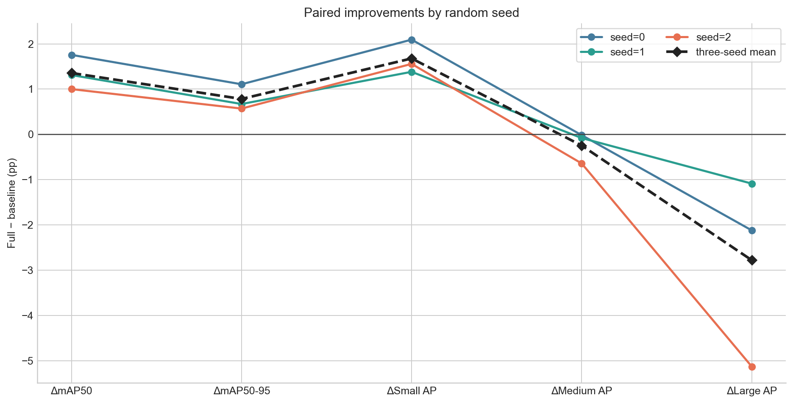
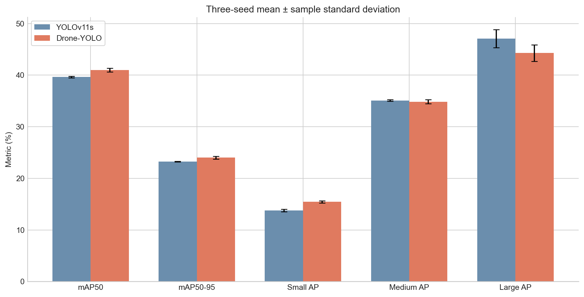

# Drone-YOLO 核心模型三随机种子配对复验报告

> 生成时间：2026-09-03T15:43:14+08:00  
> 报告口径：seed=0、1、2 的独立 150 轮训练。每个 seed 内均以相同数据、输入尺寸、初始化来源、训练预算和验证协议配对比较完整 Drone-YOLO 与 YOLOv11s 基线。表中所有精度指标单位为百分数，差值单位为百分点（pp）。

## 1. 结论摘要

**完整 Drone-YOLO 在三个随机种子下均提高了总体精度与 COCO Small AP。** 三种子的平均配对增量为 mAP50-95 **+0.78 ± 0.29 pp**、Small AP **+1.68 ± 0.37 pp**；两个指标的增量在 3/3 个 seed 中均为正。模型参数量从 9.432M 降至 2.772M（-70.6%），GFLOPs 从 21.56 降至 19.19（-11.0%）。

收益存在尺度边界：Large AP 的平均配对变化为 **-2.78 ± 2.10 pp**，三个 seed 均为负。因此，当前证据支持“轻量化模型稳定改善小目标”，不支持“对所有尺度目标均有利”。

## 2. 每个随机种子的配对差值

| Seed | ΔmAP50 | ΔmAP50-95 | ΔSmall AP | ΔMedium AP | ΔLarge AP |
|---:|---:|---:|---:|---:|---:|
| 0 | +1.76 | +1.11 | +2.09 | -0.02 | -2.12 |
| 1 | +1.31 | +0.67 | +1.38 | -0.08 | -1.09 |
| 2 | +1.00 | +0.57 | +1.56 | -0.64 | -5.13 |

## 3. 三随机种子汇总

| 指标 | YOLOv11s（均值±样本标准差） | Drone-YOLO（均值±样本标准差） | 配对变化（均值±样本标准差） |
|---|---:|---:|---:|
| mAP50 | 39.64 ± 0.15 | 40.99 ± 0.35 | 1.36 ± 0.38 |
| mAP50-95 | 23.24 ± 0.08 | 24.03 ± 0.27 | 0.78 ± 0.29 |
| Small AP | 13.78 ± 0.24 | 15.46 ± 0.22 | 1.68 ± 0.37 |
| Medium AP | 35.09 ± 0.17 | 34.85 ± 0.39 | -0.25 ± 0.34 |
| Large AP | 47.06 ± 1.75 | 44.28 ± 1.62 | -2.78 ± 2.10 |

## 4. 公平性与复杂度

- 每个 seed 内的两组均独立从 `yolo11s.pt` 初始化并训练 150 轮；未从另一模型或另一 seed 继续训练。
- 统一验证使用 VisDrone2019 val（548 张图像）、640 输入、FP32、conf=0.001、NMS IoU=0.7、max_det=300。
- 分尺寸指标在原图像坐标系中按 COCO 面积定义计算：Small＜32² px，Medium 为 32²–96² px，Large≥96² px。
- 结构复杂度为固定架构属性：YOLOv11s 为 9.432M 参数、21.56 GFLOPs；完整 Drone-YOLO 为 2.772M 参数、19.19 GFLOPs。

## 5. 可支持的结论与边界

| 主张 | 证据 | 状态 |
|---|---|---|
| 完整 Drone-YOLO 稳定提升当前协议下的 Small AP | 三个 seed 的 ΔSmall AP 均为正，均值 +1.68 pp | 支持（当前数据集与协议） |
| 完整 Drone-YOLO 稳定提升总体 mAP50-95 | 三个 seed 的 ΔmAP50-95 均为正，均值 +0.78 pp | 支持（当前数据集与协议） |
| 完整模型对所有尺度均有益 | 三个 seed 的 ΔLarge AP 均为负 | 不支持 |
| 当前实现完整复现原论文的 44.3% mAP50 | 本复验的三 seed 均值低于该论文报告值 | 不支持 |
| 模型具有统一部署速度优势 | 当前仅有单 seed、PyTorch 前向测速；无 ONNX/TensorRT 端到端复验 | 证据不足 |

## 6. 后续工作

下一步应补充固定设备上的预热端到端延迟、吞吐率和峰值显存测试，并同时报告输入预处理与后处理时间。若需要进一步改善 Large AP，应针对 LSCD 或尺度间特征交互做单因素消融，不能根据本验证集结果直接搜索多个结构参数。

## 7. 可复核材料

- 预注册：`EXPERIMENT_PLAN.md`
- 种子 1、2 的训练与评估日志：`logs/`
- 三 seed 汇总、每次评估的 JSON：`metrics/`
- 新生成的图表：`figures/`
- seed=0 的统一复测来源：`../unified_evaluation/`
