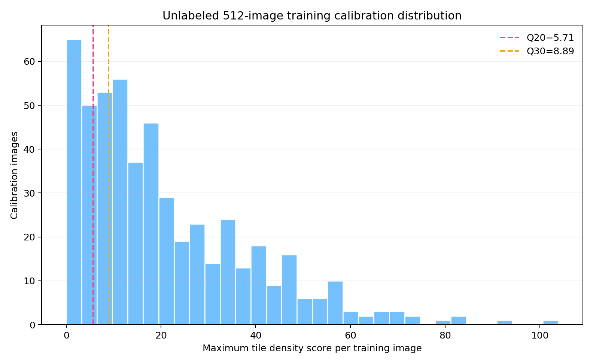
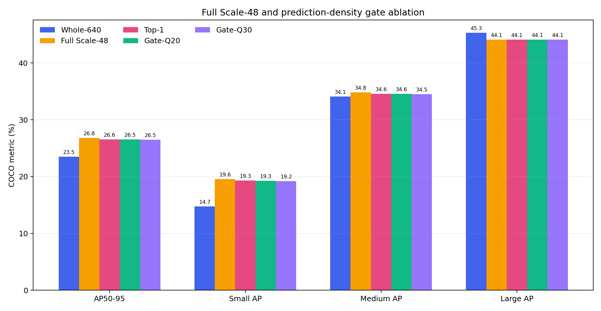
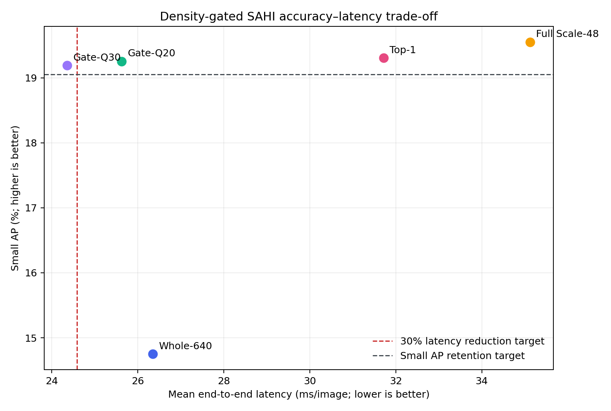
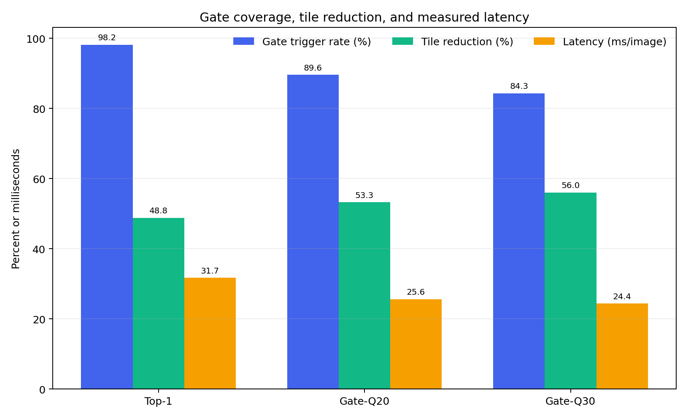
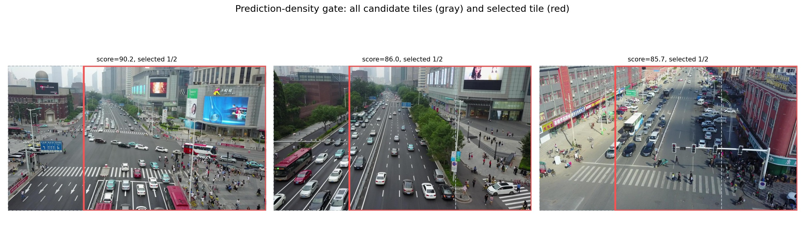

# 密度门控SAHI-960实验报告

> 生成时间：2026-08-28T09:50:12+08:00  
> 门控阈值来自512张训练图像的无标签校准；验证阶段未修改阈值。

## 1. 结论摘要

**预注册决策：三种密度门控均未通过全部预注册条件，不继续在验证集搜索阈值；保留Full Scale-48作为精度上界。**

## 2. 无标签校准

训练校准集Q20阈值为 **5.708**，Q30阈值为 **8.888**；校准过程读取标签：否。

## 3. 统一结果

| 方法 | AP50-95 | Small AP | Small AR | Medium AP | Large AP | 延迟(ms/图) | FPS |
|---|---:|---:|---:|---:|---:|---:|---:|
| Whole-640 | 23.51% | 14.75% | 24.46% | 34.10% | 45.29% | 26.35 | 37.95 |
| Full Scale-48 | 26.82% | 19.55% | 33.35% | 34.81% | 44.09% | 35.13 | 28.47 |
| Top-1 | 26.55% | 19.31% | 32.57% | 34.55% | 44.09% | 31.72 | 31.53 |
| Gate-Q20 | 26.53% | 19.26% | 32.45% | 34.55% | 44.09% | 25.63 | 39.02 |
| Gate-Q30 | 26.49% | 19.19% | 32.32% | 34.52% | 44.09% | 24.36 | 41.05 |

## 4. 相对基准变化

| 门控 | ΔAP vs Full | ΔSmall AP vs Full | ΔSmall AR vs Full | ΔMedium AP vs Full | ΔLarge AP vs Whole | 延迟降低 |
|---|---:|---:|---:|---:|---:|---:|
| Top-1 | -0.27 | -0.25 | -0.78 | -0.25 | -1.21 | +9.7% |
| Gate-Q20 | -0.30 | -0.30 | -0.90 | -0.25 | -1.21 | +27.0% |
| Gate-Q30 | -0.34 | -0.36 | -1.03 | -0.28 | -1.21 | +30.7% |

## 5. 门控效率

| 方法 | 触发图像 | 触发率 | 平均选择切片 | 切片减少 | P95延迟(ms) | 峰值显存(MB) |
|---|---:|---:|---:|---:|---:|---:|
| Top-1 | 538 | 98.18% | 0.98 | 48.81% | 37.05 | 305 |
| Gate-Q20 | 491 | 89.60% | 0.90 | 53.28% | 31.71 | 305 |
| Gate-Q30 | 462 | 84.31% | 0.84 | 56.04% | 30.73 | 305 |

## 6. 预注册判定

| 候选 | Small AP下降≤0.50 pp | AP下降≤0.20 pp | Large AP≥Whole-2.00 pp | 延迟降低≥30% | 完整性 | 结论 |
|---|---:|---:|---:|---:|---:|---:|
| Top-1 | 是 | 否 | 是 | 否 | 是 | 未通过 |
| Gate-Q20 | 是 | 否 | 是 | 否 | 是 | 未通过 |
| Gate-Q30 | 是 | 否 | 是 | 是 | 是 | 未通过 |

## 7. 证据边界

- 密度门控只使用Whole预测，不使用真实标注，具备部署可实现性。
- 阈值由训练图像无标签分布确定，但仍只在当前数据集验证，跨数据集稳定性未知。
- Whole完全漏检的小目标无法为门控提供信号，这是该方法的固有召回上限。
- 即使候选通过，仍需独立重复运行确认耗时与精度，然后再讨论轻量化贡献。

## 8. 主张—证据映射

| 主张 | 证据 | 状态 |
|---|---|---|
| 无标签密度门控满足预注册精度—延迟目标 | 三种密度门控均未通过全部预注册条件，不继续在验证集搜索阈值；保留Full Scale-48作为精度上界。 | 不支持 |
| 门控不依赖真实标注 | 校准与验证程序均只读取图像和Whole预测 | 支持 |
| 门控具有跨数据集泛化能力 | 尚未在其他数据集验证 | 证据不足 |

## 9. 可追溯产物

- 预注册方案：`EXPERIMENT_PLAN.md`
- 无标签校准、三组指标、预测与CSV：`metrics/`
- 运行日志：`logs/`
- 图表与门控示意：`figures/`
