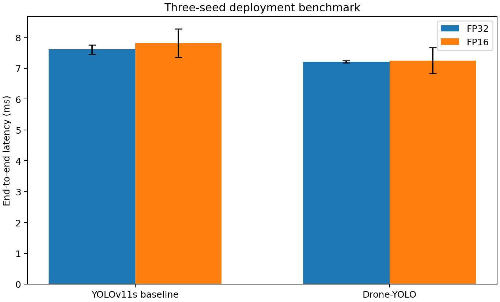
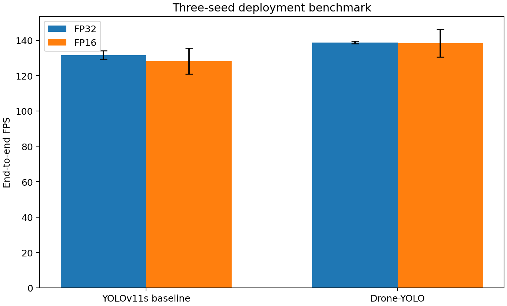
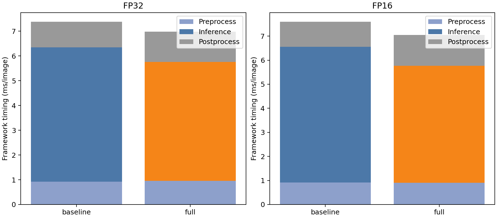

# 三种子端到端部署基准

> 生成时间：2026-09-03T20:50:49+08:00  
> 设备：NVIDIA GeForce RTX 4080 SUPER；固定输入：`E:\yolo_dcaf\data\VisDrone_YOLO\val\images\0000001_02999_d_0000005.jpg`；batch=1，640×640，预热50次、测量200次。

## 1. 端到端结果

| 精度 | 模型 | 平均延迟（ms） | p95 延迟（ms） | FPS | 峰值分配显存（MiB） | 参数量（M） |
|---|---|---:|---:|---:|---:|---:|
| FP32 | YOLOv11s 基线 | 7.61 ± 0.15 | 9.53 ± 0.63 | 131.47 ± 2.49 | 121 ± 21 | 9.417 |
| FP32 | Drone-YOLO | 7.21 ± 0.03 | 9.48 ± 0.34 | 138.73 ± 0.66 | 110 ± 15 | 2.766 |
| FP16 | YOLOv11s 基线 | 7.81 ± 0.46 | 10.24 ± 0.48 | 128.25 ± 7.28 | 78 ± 4 | 9.417 |
| FP16 | Drone-YOLO | 7.25 ± 0.42 | 10.35 ± 1.38 | 138.27 ± 7.82 | 71 ± 7 | 2.766 |

## 2. 时间组成

Drone-YOLO 相对基线的平均端到端延迟变化：FP32 **-5.3%**，FP16 **-7.2%**。该数字只描述本机固定协议下的实测结果；应结合上图中的预处理、前向与后处理时间解释，不应用参数量或 GFLOPs 直接替代。

## 3. 可追溯性与边界

- 每个模型均使用三个已完成训练种子；原始逐检查点结果在 `metrics/raw_runs.json`，聚合统计在 `metrics/summary.json`。
- 测试包括图像预处理、模型前向和 NMS/结果后处理，不包括磁盘 I/O、模型加载及首次初始化。
- 此处是单卡、batch=1 的框架级基准；TensorRT、ONNX 或不同 GPU 的绝对延迟需另行测量。
