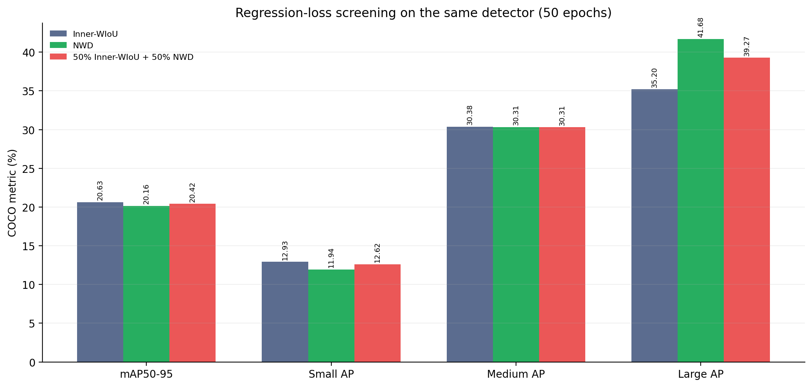
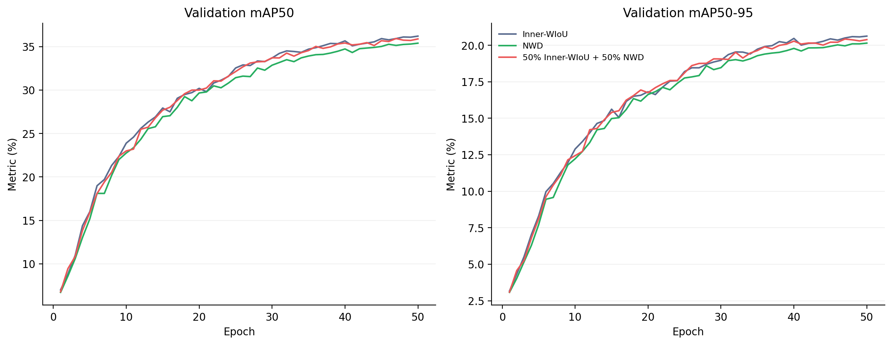
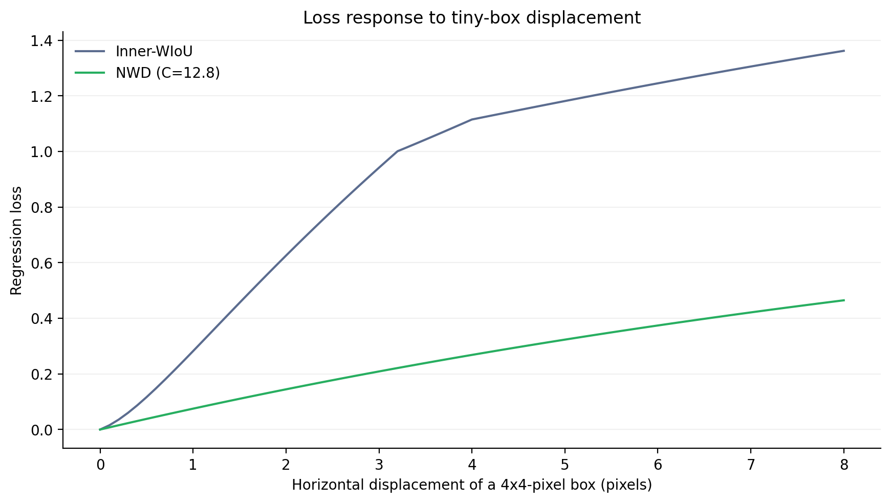

# NWD回归损失：50轮筛选报告

> 生成时间：2026-08-27T01:33:48+08:00  
> 三组使用相同MF-FPN+LSCD结构；仅框回归项不同。TAL标签分配、DFL和训练超参数保持一致。

## 1. 统一结果

| 回归损失 | mAP50 | mAP50-95 | Small AP | Small AP50 | Medium AP | Large AP | 参数量(M) | GFLOPs |
|---|---:|---:|---:|---:|---:|---:|---:|---:|
| Inner-WIoU | 36.21% | 20.63% | 12.93% | 27.18% | 30.38% | 35.20% | 2.772 | 19.19 |
| NWD | 35.41% | 20.16% | 11.94% | 25.47% | 30.31% | 41.68% | 2.772 | 19.19 |
| 50% Inner-WIoU + 50% NWD | 35.91% | 20.42% | 12.62% | 26.68% | 30.31% | 39.27% | 2.772 | 19.19 |

## 2. 相对Inner-WIoU的变化

| 候选损失 | ΔmAP50-95 | ΔSmall AP | ΔSmall AP50 | ΔMedium AP | ΔLarge AP |
|---|---:|---:|---:|---:|---:|
| NWD | -0.47 | -0.99 | -1.70 | -0.06 | +6.49 |
| 50% Inner-WIoU + 50% NWD | -0.21 | -0.31 | -0.49 | -0.07 | +4.08 |

## 3. 微小框位移响应

该曲线只说明不同损失对4×4像素框位移的数值响应，不构成检测性能证据。

## 4. 预注册判定

| 候选 | Small AP≥+0.30 pp | mAP50-95≥-0.10 pp | Large AP≥-1.00 pp | 无推理开销增加 |
|---|---:|---:|---:|---:|
| NWD | 否 | 否 | 是 | 是 |
| 50% Inner-WIoU + 50% NWD | 否 | 否 | 是 | 是 |

**结论：NWD和混合损失均未通过预注册条件，不建议进入150轮；应停止该损失方向或重新审视NWD用于标签分配的方案。**

## 5. 主张—证据映射

| 主张 | 当前证据 | 状态 |
|---|---|---|
| NWD回归改善小目标 | ΔSmall AP -0.99 pp | 不支持 |
| 混合回归改善小目标 | ΔSmall AP -0.31 pp | 不支持 |
| 候选损失为最终贡献 | 尚无150轮与多随机种子证据 | 不能声称 |

## 6. 可追溯产物

- 预注册方案：`EXPERIMENT_PLAN.md`
- 训练和评估日志：`logs/`
- JSON及CSV指标：`metrics/`
- 三组检查点：`../../runs/loss_*_50e/weights/best.pt`
