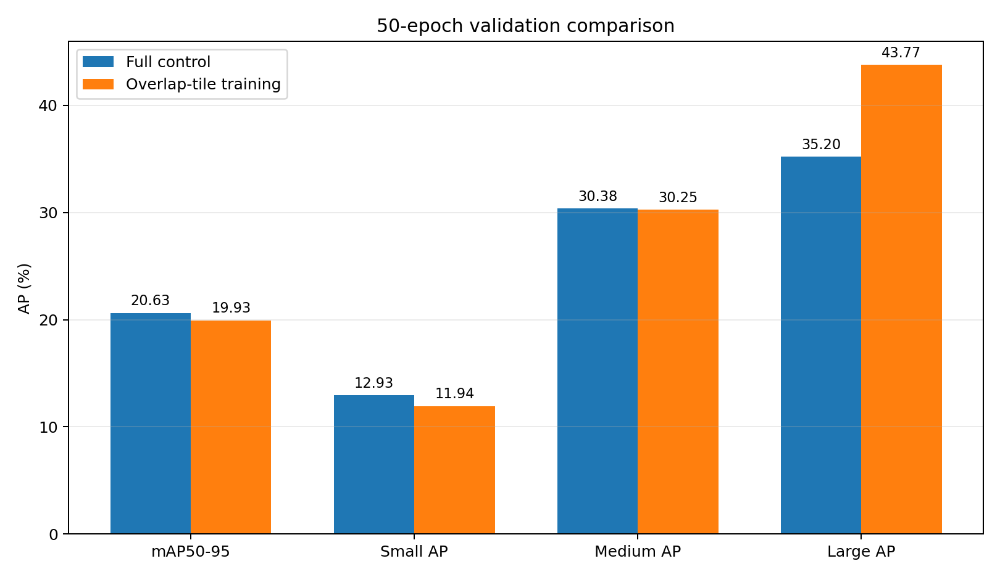
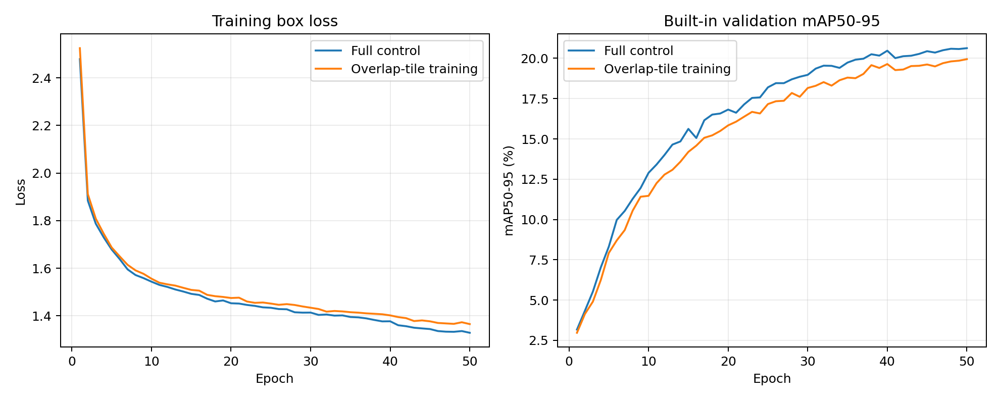
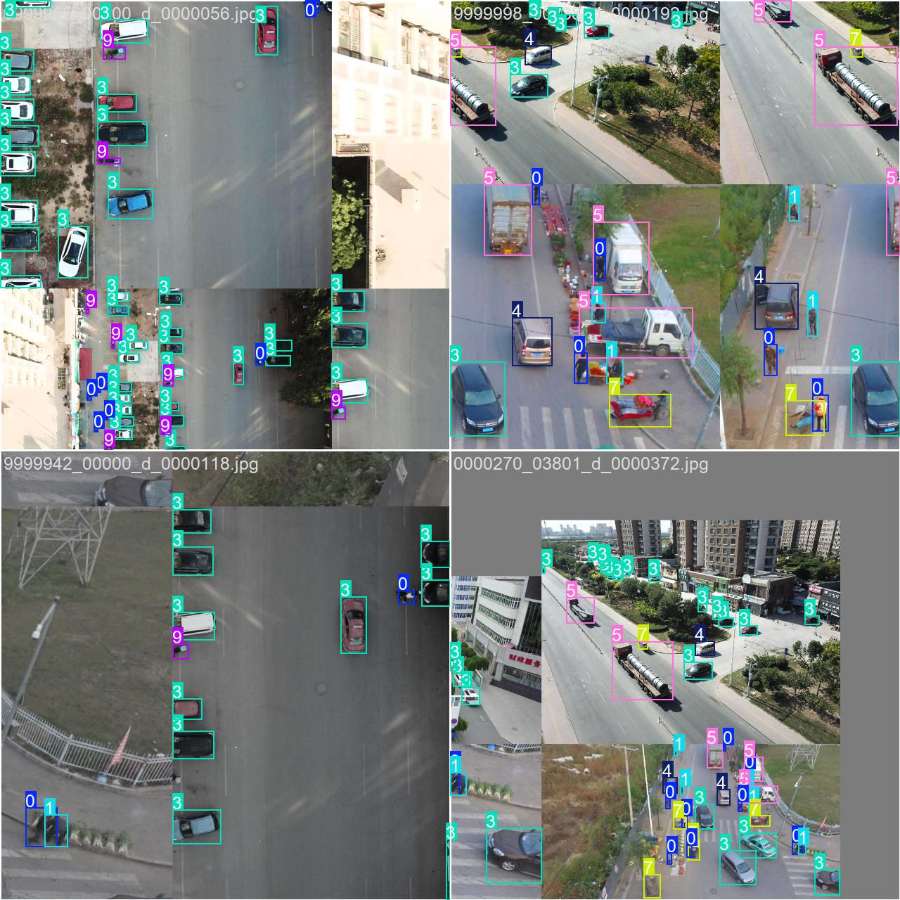

# 重叠切片训练：50 轮筛选报告

## 实验结论

**未通过预注册筛选标准。** 本配置未同时满足筛选门槛，应停止该固定配置，不再对窗口大小、重叠率或采样概率进行结果导向调整。

## 指标对比

所有指标均为百分数，差值单位为百分点（pp）。两组的模型、初始化、每轮 batch 数、总优化步数和验证协议一致；实验组唯一改变是训练读取时以 50% 概率使用 640 px、名义 20% 重叠的完整覆盖切片。

| 指标 | Full 对照 | 重叠切片训练 | 差值 |
|---|---:|---:|---:|
| mAP50-95 | 20.6263 | 19.9336 | -0.6927 |
| AP50 | 36.2103 | 34.8906 | -1.3197 |
| Precision | 49.1404 | 47.0742 | -2.0662 |
| Recall | 37.8005 | 36.9657 | -0.8349 |
| Small AP | 12.9291 | 11.9383 | -0.9908 |
| Medium AP | 30.3754 | 30.2455 | -0.1300 |
| Large AP | 35.1959 | 43.7694 | +8.5735 |

## 判据核验

- 未通过：Small AP ≥ +0.50 pp
- 未通过：mAP50-95 ≥ -0.20 pp
- 通过：Medium AP ≥ -0.50 pp
- 通过：Large AP ≥ -0.50 pp

## 切片样例

## 可复核材料

- 预注册：`reports/overlap_tile_training/EXPERIMENT_PLAN.md`
- 实验组检查点：`runs/overlap_tiles_50e/weights/best.pt`
- 总体指标：`reports/overlap_tile_training/metrics/overlap_tiles_val.json`
- 尺寸指标：`reports/overlap_tile_training/metrics/overlap_tiles_size_val.json`
- 训练日志：`reports/overlap_tile_training/logs/overlap_tiles_train.log`
