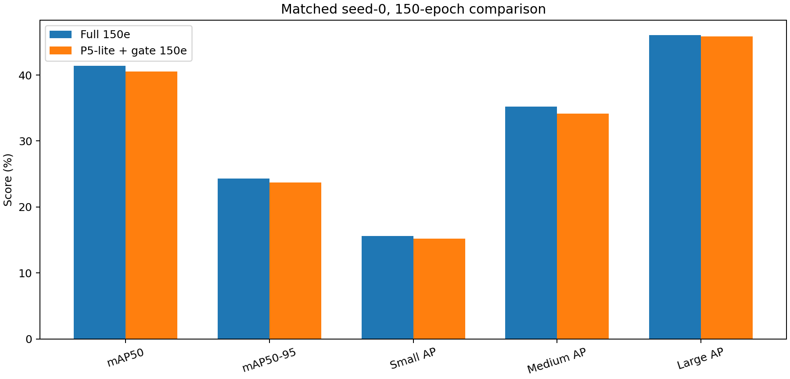
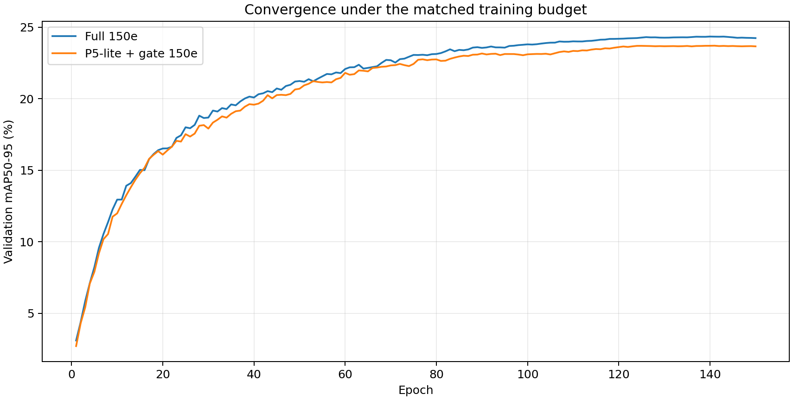

# P5-lite 空间门控：150轮探索性复验报告

> 生成时间：2026-09-04T18:25:30+08:00  
> 两组均为 seed=0、从 yolo11s.pt 独立初始化、训练150轮；本实验不改变50轮筛选未通过的历史结论。

## 1. 统一验证结果

| 指标 | Full 150轮对照 | P5-lite + gate 150轮 | Δ（百分点） |
|---|---:|---:|---:|
| mAP50 | 41.40% | 40.53% | -0.87 |
| mAP50-95 | 24.34% | 23.70% | -0.63 |
| Small AP | 15.62% | 15.20% | -0.42 |
| Medium AP | 35.24% | 34.17% | -1.07 |
| Large AP | 46.04% | 45.87% | -0.18 |

| 推理结构 | Full | P5-lite + gate | 差值 |
|---|---:|---:|---:|
| 参数量（M） | 2.772 | 2.843 | +0.071 |
| GFLOPs | 19.19 | 19.33 | +0.14 |

候选训练日志中的最高 mAP50-95 出现在第 142 轮，为 23.70%。最终结论使用统一加载 `best.pt` 后的独立验证结果。

## 2. 预注册判定

| 条件 | 结果 |
|---|---|
| Large AP Δ ≥ +1.00 pp | 未通过 |
| Small AP Δ ≥ -0.30 pp | 未通过 |
| mAP50-95 Δ ≥ -0.10 pp | 未通过 |
| Parameters ≤ 3.50M | 通过 |
| GFLOPs ≤ 22.00 | 通过 |

**结论：未通过：停止当前全尺度反馈配置，转入仅增强最终 P4 分支的结构实验。**

## 3. 证据边界

本报告是针对50轮临界候选追加的探索性长训，仅包含一个随机种子。即使通过，也只能说明该候选值得进入多随机种子复验；在 seed=1、2 完成前，不能声称性能提升稳定。若未通过，只否定当前128通道、全尺度传播和固定门控初始化的精确组合。

## 4. 可追溯产物

- 长训预注册：`LONGRUN_PLAN.md`
- 训练、验证、报告日志：`logs/`
- 结构化结果和对比表：`metrics/`
- 候选检查点：`../../runs/p5lite_gated_seed0_150e/weights/best.pt`
