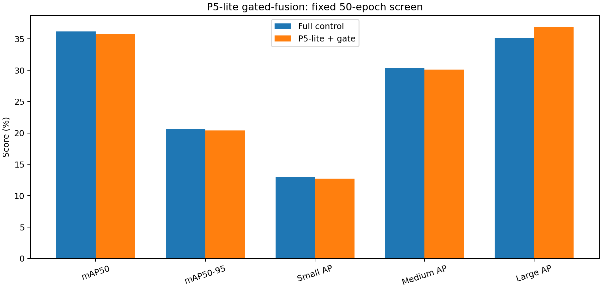
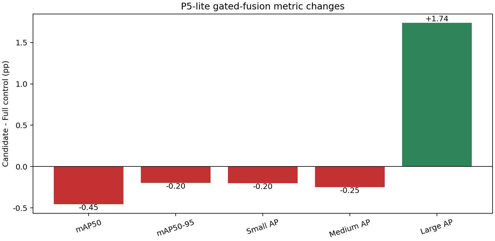

# P5-lite 语义反馈与空间门控：50轮筛选报告

> 生成时间：2026-09-04T14:09:39+08:00  
> 候选：P5-lite 内部语义反馈 + 像素级空间门控；检测层仍为 P2/P3/P4。

## 1. 固定协议比较

| 指标 | Full 50轮对照 | P5-lite + gate | Δ（百分点） |
|---|---:|---:|---:|
| mAP50 | 36.21% | 35.76% | -0.45 |
| mAP50-95 | 20.63% | 20.43% | -0.20 |
| Small AP | 12.93% | 12.73% | -0.20 |
| Medium AP | 30.38% | 30.13% | -0.25 |
| Large AP | 35.20% | 36.93% | +1.74 |

| 推理结构 | Full 50轮对照 | P5-lite + gate | 差值 |
|---|---:|---:|---:|
| 参数量（M） | 2.772 | 2.843 | +0.071 |
| GFLOPs | 19.19 | 19.33 | +0.14 |

## 2. 预注册判定

| 条件 | 结果 |
|---|---|
| Large AP Δ ≥ +1.00 pp | 通过 |
| Small AP Δ ≥ -0.30 pp | 通过 |
| mAP50-95 Δ ≥ -0.10 pp | 未通过 |
| Parameters ≤ 3.50M | 通过 |
| GFLOPs ≤ 22.00 | 通过 |

**结论：未通过筛选：停止此精确配置；不将个别指标改善解释为整体有效。**

## 3. 解释边界与下一步

本结果只检验 seed=0、50轮、128通道 P5-lite、初始 gate bias=-2 的组合。通过门槛后仍需使用更长训练和三个随机种子验证稳定性；未通过只能说明该精确的反馈路径与门控设置未同时满足“补大目标且不伤小目标”的目标，不能外推为所有跨尺度语义反馈都无效。

## 4. 可追溯产物

- 预注册方案：`EXPERIMENT_PLAN.md`
- 训练、验证、报告日志：`logs/`
- 结构化指标及对照表：`metrics/`
- 学生检查点：`../../runs/p5lite_gated_seed0_50e/weights/best.pt`
