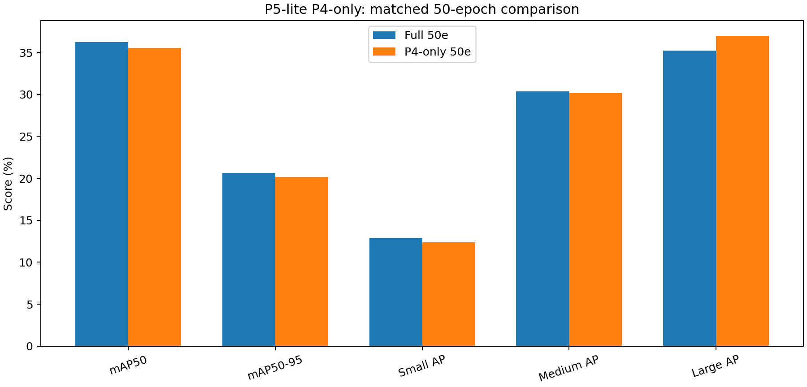
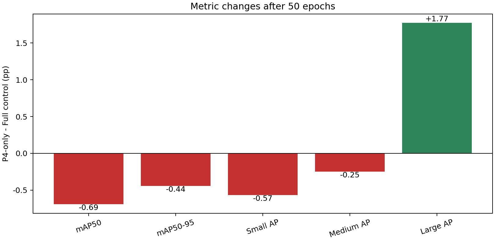

# P5-lite 仅增强 P4：50轮实验报告

> 生成时间：2026-09-05T01:08:56+08:00  
> 候选仅改变最终P4检测输入；P2/P3直接特征路径保持Full模型不变。

## 统一指标

| 指标 | Full 50轮对照 | P4-only候选 | Δ（百分点） |
|---|---:|---:|---:|
| mAP50 | 36.21% | 35.52% | -0.69 |
| mAP50-95 | 20.63% | 20.19% | -0.44 |
| Small AP | 12.93% | 12.36% | -0.57 |
| Medium AP | 30.38% | 30.13% | -0.25 |
| Large AP | 35.20% | 36.97% | +1.77 |

| 结构指标 | Full | P4-only | 差值 |
|---|---:|---:|---:|
| 参数量（M） | 2.772 | 2.843 | +0.071 |
| GFLOPs | 19.19 | 19.33 | +0.14 |

## 预注册判断

| 条件 | 结果 |
|---|---|
| Large AP Δ ≥ +1.00 pp | 通过 |
| Small AP Δ ≥ -0.30 pp | 未通过 |
| mAP50-95 Δ ≥ -0.10 pp | 未通过 |
| Parameters ≤ 3.50M | 通过 |
| GFLOPs ≤ 22.00 | 通过 |

**结论：未通过，停止当前精确配置，不进入下一阶段。**

## 解释边界

该结果只检验128隐藏通道、gate bias=-2和当前LSCD共享检测头。P2/P3没有直接接收P5-lite特征，但三个尺度仍通过共享检测头参数间接耦合。单随机种子结果只能用于阶段筛选，不能直接表述为稳定提升。
