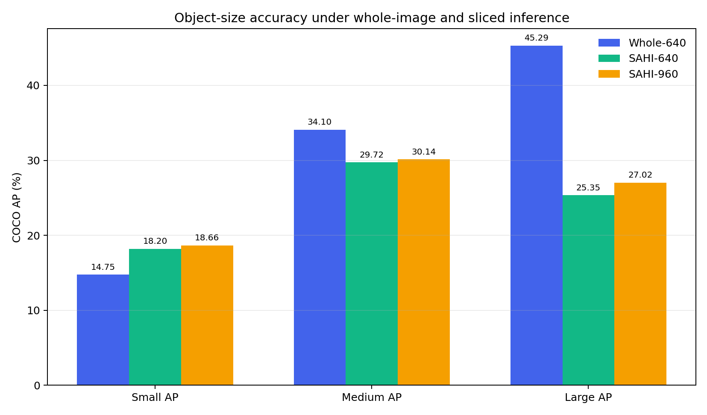
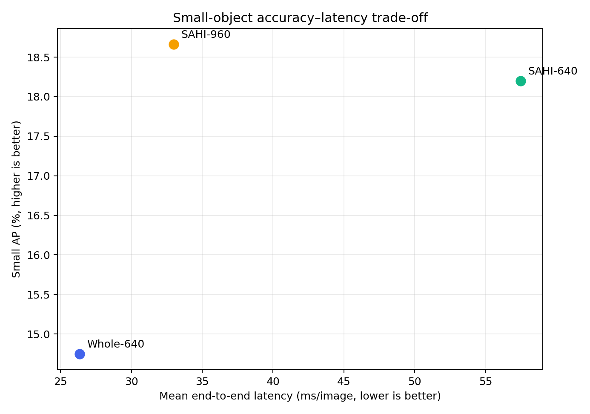
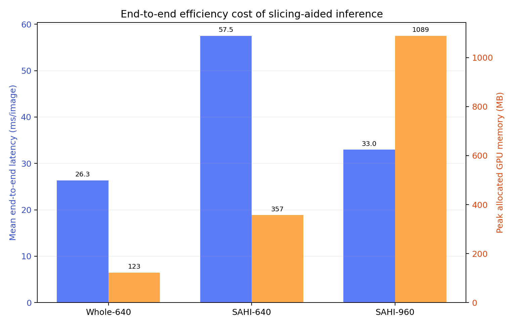
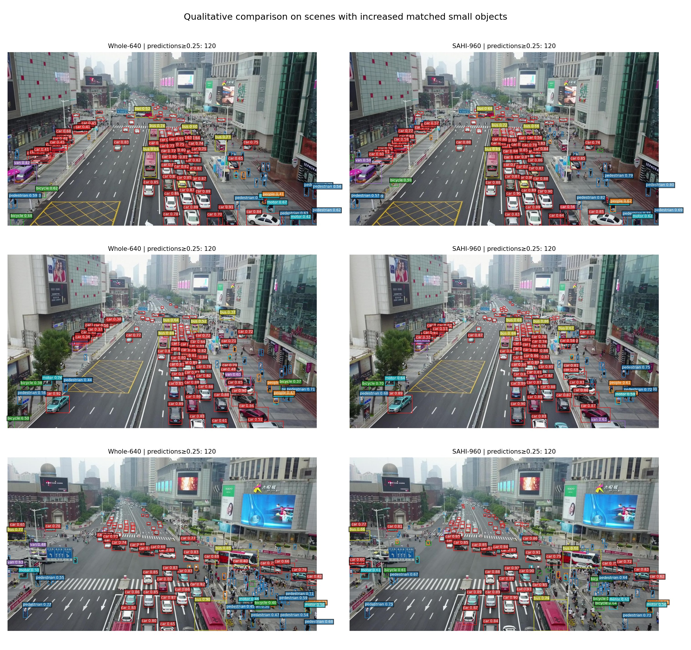

# SAHI切片推理对照报告

> 生成时间：2026-08-27T15:37:01+08:00  
> 固定150轮完整模型权重，仅改变推理方式；所有框在原图坐标下统一COCO评估。

## 1. 结论摘要

Small AP最高的切片设置为 **SAHI-960**，相对Whole-640变化 **+3.91 个百分点**。
**预注册决策：SAHI-960通过预注册条件，建议进入密度自适应切片研究；切片只作为精度上界，下一阶段必须降低端到端延迟。**

## 2. 评估入口兼容性说明

| 入口 | AP50-95 | Small AP | 用途 |
|---|---:|---:|---|
| 既有Ultralytics `model.val`批量验证 | 24.55% | 15.62% | 与前期150轮统一评估衔接 |
| 本实验逐图 `model.predict` Whole-640 | 23.51% | 14.75% | SAHI的同管线因果对照 |

两种入口的AP50-95相差 **-1.05 个百分点**，Small AP相差 **-0.87 个百分点**。该差异可能来自批量矩形验证与逐图固定方形预测的预处理、填充及执行路径差异；当前证据不能进一步归因。为避免混用协议，本报告所有SAHI增量和预注册判定只使用同一 `model.predict` 管线的Whole-640对照；既有数值仅作为兼容性参考。

## 3. 统一结果

| 方法 | AP50 | AP50-95 | Small AP | Small AP50 | Small AR | Medium AP | Large AP | 延迟(ms/图) | FPS |
|---|---:|---:|---:|---:|---:|---:|---:|---:|---:|
| Whole-640 | 39.52% | 23.51% | 14.75% | 29.86% | 24.46% | 34.10% | 45.29% | 26.3 | 38.0 |
| SAHI-640 | 41.72% | 23.32% | 18.20% | 36.31% | 32.27% | 29.72% | 25.35% | 57.5 | 17.4 |
| SAHI-960 | 42.17% | 23.76% | 18.66% | 37.08% | 31.64% | 30.14% | 27.02% | 33.0 | 30.3 |

## 4. 相对Whole-640的变化

| 方法 | ΔAP50-95 | ΔSmall AP | ΔSmall AP50 | ΔSmall AR | ΔMedium AP | ΔLarge AP | 延迟倍数 |
|---|---:|---:|---:|---:|---:|---:|---:|
| SAHI-640 | -0.19 | +3.45 | +6.45 | +7.80 | -4.37 | -19.94 | 2.18× |
| SAHI-960 | +0.25 | +3.91 | +7.22 | +7.18 | -3.95 | -18.28 | 1.25× |

## 5. 效率代价

| 方法 | 平均切片数 | 640像素计算当量 | P95延迟(ms) | 峰值显存(MB) | 重复框抑制比例 |
|---|---:|---:|---:|---:|---:|
| Whole-640 | 1.00 | 1.00× | 32.2 | 123 | 0.04% |
| SAHI-640 | 5.19 | 5.19× | 80.1 | 357 | 79.17% |
| SAHI-960 | 1.92 | 4.32× | 36.9 | 1089 | 56.42% |

“640像素计算当量”按平均切片数×(输入边长/640)²估算，只反映输入像素规模，不替代实测延迟。

## 6. 预注册判定

| 候选 | Small AP≥+1.00 pp | AP50-95不下降 | Small AR提高 | 548张完整 | 最终判定 |
|---|---:|---:|---:|---:|---:|
| SAHI-640 | 是 | 否 | 是 | 是 | 未通过 |
| SAHI-960 | 是 | 是 | 是 | 是 | 通过 |

## 7. 定性结果

图像根据置信度≥0.25时正确匹配的小目标增加量选择，只用于解释典型成功场景；总体结论仍以全部548张的COCO指标为准。

## 8. 证据边界与局限

- 三组使用同一检查点和验证集，能够隔离推理切片的影响。
- SAHI不增加模型参数，但增加输入像素、推理次数与端到端延迟，因此不能直接作为轻量化结论。
- 当前全局合并固定为类别感知NMS、IoU=0.5；本报告不包含阈值后验搜索。
- SAHI-960虽然提高总体AP和Small AP，但Medium AP与Large AP分别下降3.95和18.28个百分点；后续必须融合整图预测或采用尺度感知保留策略。
- 端到端耗时包含图像解码、切片、推理、合并和JSON序列化，仅代表当前RTX 4080 SUPER与PyTorch环境。

## 9. 主张—证据映射

| 主张 | 证据 | 状态 |
|---|---|---|
| 切片改善当前模型的小目标检测 | 最佳ΔSmall AP +3.91 pp | 支持 |
| 切片满足预注册晋级条件 | SAHI-960通过预注册条件，建议进入密度自适应切片研究；切片只作为精度上界，下一阶段必须降低端到端延迟。 | 支持 |
| 切片属于轻量化改进 | 推理次数和端到端延迟均增加 | 不支持 |

## 10. 可追溯产物

- 预注册方案：`EXPERIMENT_PLAN.md`
- 结构化指标与预测：`metrics/`
- 三组完整日志：`logs/`
- 图表和定性结果：`figures/`
