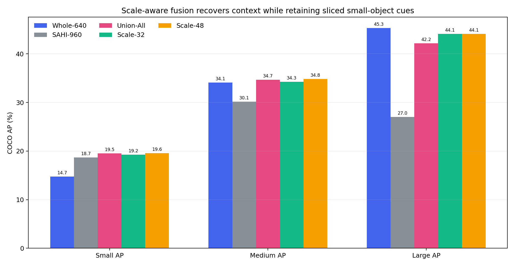
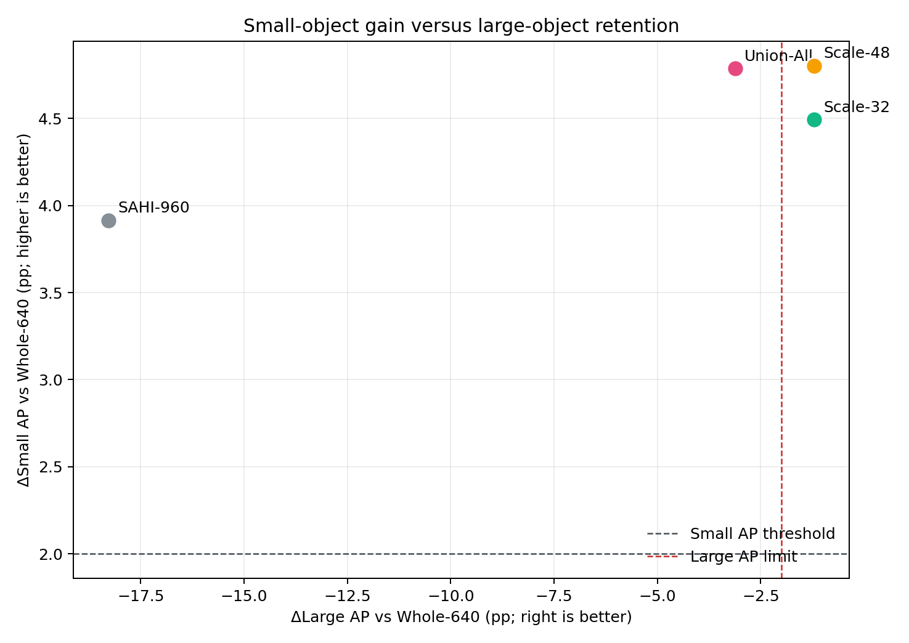
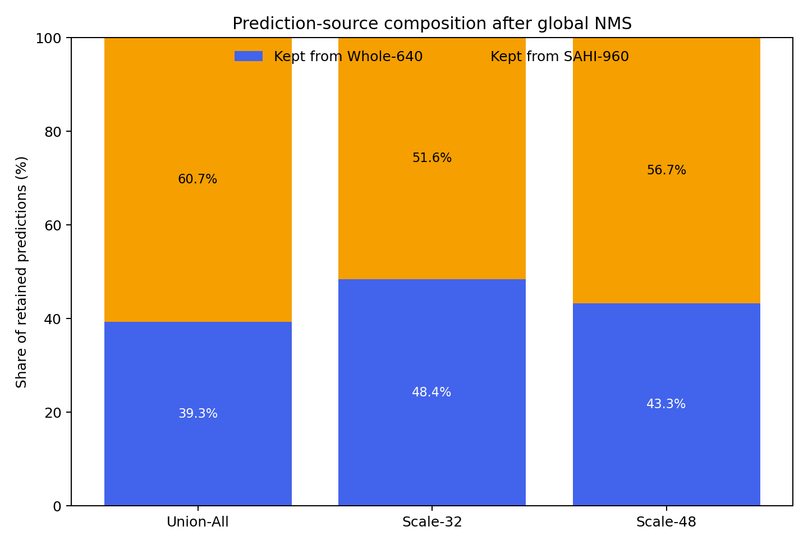
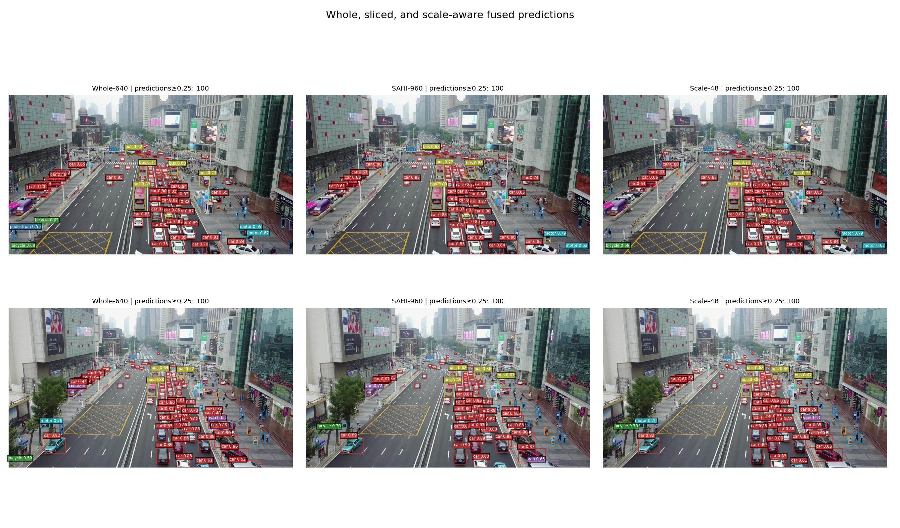

# Whole-640与SAHI-960尺度感知融合报告

> 生成时间：2026-08-27T16:11:39+08:00  
> 本实验复用缓存预测，仅改变预测框选择与全局类别感知NMS；不重新训练或推理。

## 1. 结论摘要

**预注册决策：Scale-48通过全部预注册条件，建议进入实际联合推理与密度自适应切片。**

## 2. 统一结果

| 方法 | AP50-95 | Small AP | Small AP50 | Small AR | Medium AP | Large AP | 估计延迟(ms/图) |
|---|---:|---:|---:|---:|---:|---:|---:|
| Whole-640 | 23.51% | 14.75% | 29.86% | 24.46% | 34.10% | 45.29% | 26.3 |
| SAHI-960 | 23.76% | 18.66% | 37.08% | 31.64% | 30.14% | 27.02% | 33.0 |
| Union-All | 26.53% | 19.53% | 38.90% | 33.28% | 34.70% | 42.18% | 60.0 |
| Scale-32 | 26.34% | 19.24% | 38.42% | 33.25% | 34.28% | 44.09% | 59.9 |
| Scale-48 | 26.82% | 19.55% | 38.93% | 33.35% | 34.81% | 44.09% | 59.9 |

融合方法的延迟为Whole与SAHI实测均值之和再加缓存后处理时间，是保守估计，不是真实集成部署测速。

## 3. 相对Whole-640的变化

| 方法 | ΔAP50-95 | ΔSmall AP | ΔSmall AR | ΔMedium AP | ΔLarge AP |
|---|---:|---:|---:|---:|---:|
| SAHI-960 | +0.25 | +3.91 | +7.18 | -3.95 | -18.28 |
| Union-All | +3.03 | +4.78 | +8.82 | +0.60 | -3.12 |
| Scale-32 | +2.84 | +4.49 | +8.78 | +0.18 | -1.21 |
| Scale-48 | +3.32 | +4.80 | +8.89 | +0.71 | -1.21 |

## 4. 融合来源与效率

| 融合方法 | CPU融合(ms/图) | 保留Whole框 | 保留SAHI框 | 估计FPS |
|---|---:|---:|---:|---:|
| Union-All | 0.640 | 62399 | 96182 | 16.7 |
| Scale-32 | 0.571 | 74420 | 79254 | 16.7 |
| Scale-48 | 0.617 | 67835 | 88964 | 16.7 |

## 5. 预注册判定

| 候选 | Small AP≥+2.00 pp | 总体AP不下降 | Medium AP≥-1.00 pp | Large AP≥-2.00 pp | 548张完整 | 结论 |
|---|---:|---:|---:|---:|---:|---:|
| Union-All | 是 | 是 | 是 | 否 | 是 | 未通过 |
| Scale-32 | 是 | 是 | 是 | 是 | 是 | 通过 |
| Scale-48 | 是 | 是 | 是 | 是 | 是 | 通过 |

## 6. 定性结果

定性图根据融合后置信度≥0.25的小目标正确匹配增量选择，同时要求场景包含中或大目标；定量结论以全部548张评估为准。

## 7. 证据边界与局限

- 三组融合规则在查看融合结果前固定，未继续搜索尺度阈值或NMS参数。
- 本实验能够验证缓存预测的尺度选择效果，但不能证明真实联合推理延迟。
- 融合需要Whole与SAHI两路预测，不增加参数量但增加总计算，尚不能称为轻量化方法。
- 预测框面积只是目标真实尺度的代理，边界附近可能发生尺度误分。

## 8. 主张—证据映射

| 主张 | 证据 | 状态 |
|---|---|---|
| 尺度感知融合同时保留小目标增益与大目标能力 | Scale-48通过全部预注册条件，建议进入实际联合推理与密度自适应切片。 | 支持 |
| 融合规则不增加模型参数 | 仅对缓存框执行筛选和NMS | 支持 |
| 融合保持轻量推理 | 需要两路模型推理，当前仅有保守延迟估计 | 不支持 |

## 9. 可追溯产物

- 预注册方案：`EXPERIMENT_PLAN.md`
- 三组融合预测、指标与CSV：`metrics/`
- 运行日志：`logs/`
- 图表与定性结果：`figures/`
