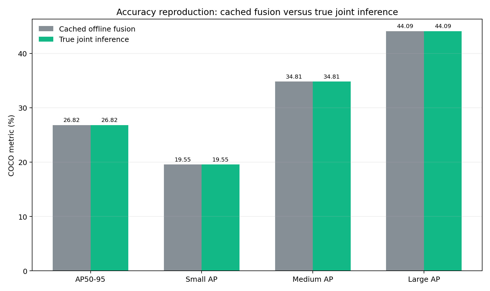
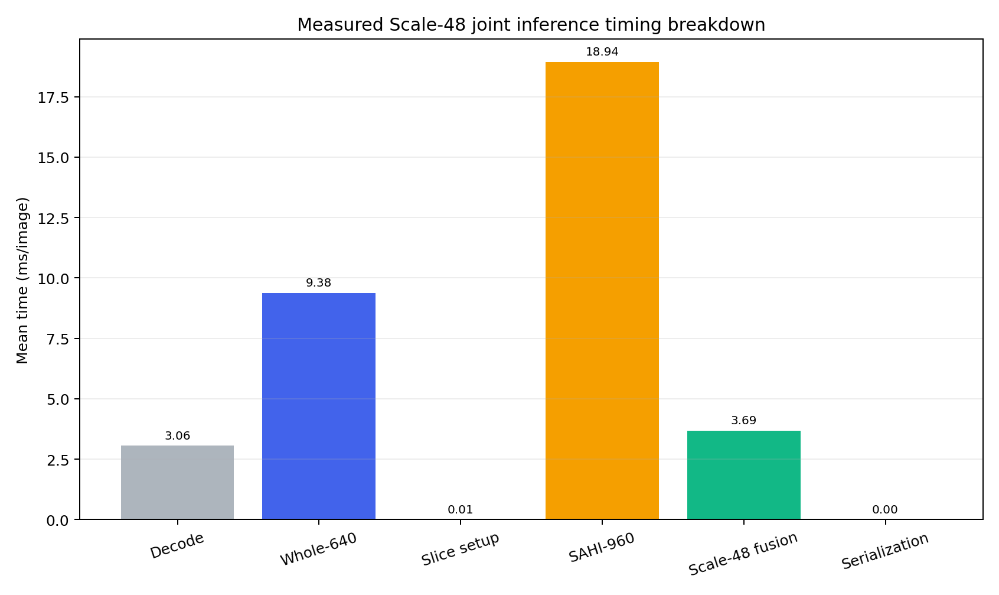
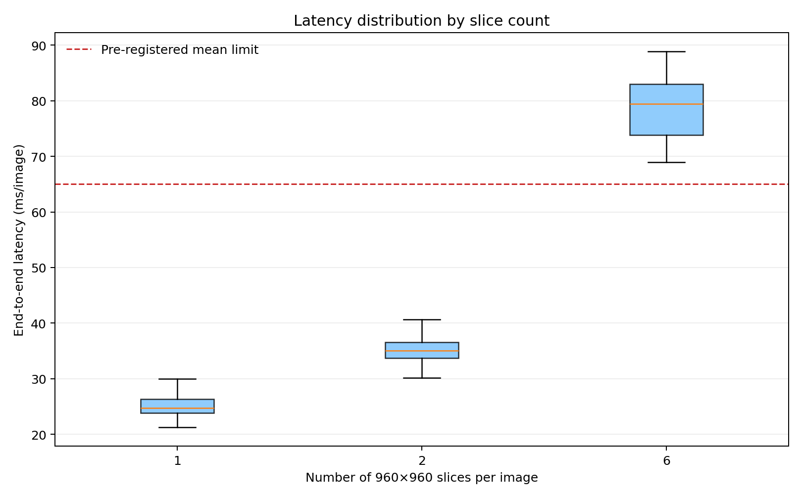

# Scale-48真实联合推理复验报告

> 生成时间：2026-08-27T17:25:27+08:00  
> 每张图像单次解码，在同一模型进程中顺序执行Whole-640、SAHI-960与Scale-48融合。

## 1. 结论摘要

**预注册决策：真实联合推理复现成功，可进入密度自适应切片实验。**

## 2. 精度复现

| 尺度 | 离线AP | 联合AP | 差值(pp) | 离线AP50 | 联合AP50 | 差值(pp) |
|---|---:|---:|---:|---:|---:|---:|
| All | 26.82% | 26.82% | +0.000 | 46.16% | 46.16% | +0.000 |
| Small | 19.55% | 19.55% | +0.000 | 38.93% | 38.93% | +0.000 |
| Medium | 34.81% | 34.81% | +0.000 | 55.32% | 55.32% | +0.000 |
| Large | 44.09% | 44.09% | +0.000 | 61.37% | 61.37% | +0.000 |

## 3. 真实效率

| 指标 | 数值 |
|---|---:|
| 平均端到端延迟 | 35.13 ms/图 |
| 中位数延迟 | 34.43 ms/图 |
| P95延迟 | 40.59 ms/图 |
| FPS | 28.47 |
| Whole-640平均延迟 | 26.35 ms/图 |
| 相对Whole-640延迟倍数 | 1.33× |
| 离线保守延迟估计 | 59.94 ms/图 |
| 相对保守估计降低 | 41.40% |
| 平均切片数 | 1.92 |
| 峰值GPU显存 | 1088 MB |
| 全部548张墙钟时间 | 19.25 s |

## 4. 完整性审计

| 项目 | 结果 |
|---|---:|
| 图像数 | 548 |
| 输出预测框 | 156799 |
| 单图最大预测框 | 300 |
| 越界或无效框 | 0 |
| 检查点SHA匹配 | 是 |

## 5. 预注册判定

| 条件 | 是否通过 |
|---|---:|
| AP50-95差异≤0.10 pp | 是 |
| Small AP差异≤0.10 pp | 是 |
| Medium/Large AP差异均≤0.10 pp | 是 |
| 平均延迟≤65 ms/图 | 是 |
| 548张完整、零越界 | 是 |
| 同一检查点 | 是 |

## 6. 证据边界与下一步

本实验使用同一Python进程顺序执行两路推理，精度和延迟可以作为后续密度门控的真实基线；但结果仅适用于当前RTX 4080 SUPER与PyTorch环境，不能替代ONNX/TensorRT部署测试。Scale-48仍需两路推理，因此不构成轻量化结论。

下一步可固定本结果为全量切片上界，设计候选区域门控，只对小目标密集区域运行SAHI-960，并以Small AP下降≤0.50 pp、总体AP下降≤0.20 pp、延迟降低≥30%作为筛选条件。

## 7. 主张—证据映射

| 主张 | 证据 | 状态 |
|---|---|---|
| 离线Scale-48精度可由真实联合程序复现 | 最大尺度AP差异 0.000 pp | 支持 |
| 当前联合程序满足65 ms延迟目标 | 平均 35.13 ms/图 | 支持 |
| 当前方法已经轻量化 | 仍执行Whole与SAHI两路推理 | 不支持 |

## 8. 可追溯产物

- 预注册方案：`EXPERIMENT_PLAN.md`
- 联合预测、结构化指标及逐图耗时：`metrics/`
- 运行日志：`logs/`
- 精度与效率图：`figures/`
