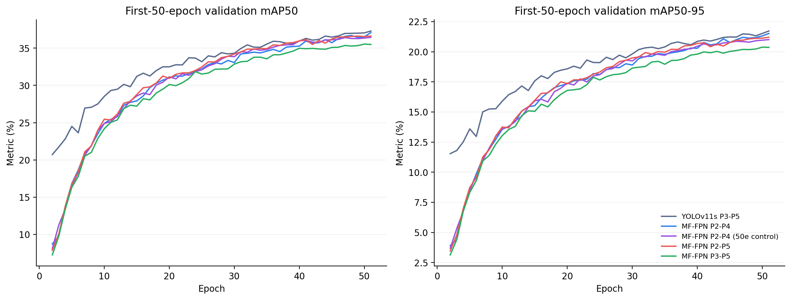
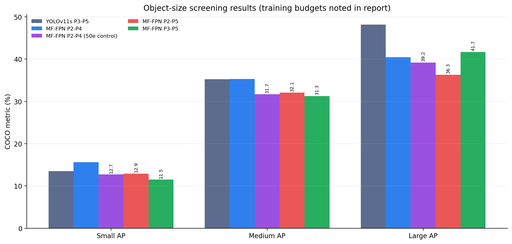
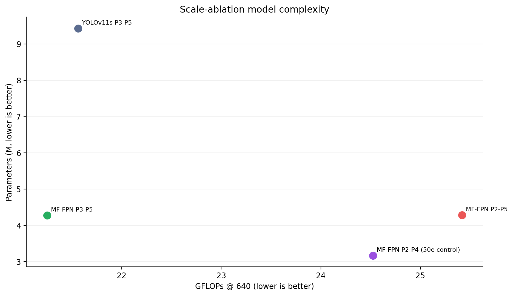

# Drone-YOLO 检测尺度消融：独立50轮公平对照报告

> 生成时间：2026-08-25T12:47:53+08:00  
> 实验性质：结构筛选；P2–P4、P2–P5、P3–P5三组候选均独立训练50轮。既有基线与原始MF-FPN的150轮结果只作背景参考。

## 1. 实验问题

本实验检验两个问题：在P2–P4上加入P5是否改善大目标性能；在P2–P5上移除P2后，小目标性能是否下降。三组50轮候选除Detect输入尺度外共享相同特征路径，训练数据、输入尺寸、优化器、随机种子和验证协议保持一致。

## 2. 统一结果

| 模型 | 检测步长 | 训练轮次 | mAP50 | mAP50-95 | Small AP | Medium AP | Large AP | 参数量(M) | GFLOPs |
|---|---|---:|---:|---:|---:|---:|---:|---:|---:|
| YOLOv11s P3-P5 | 8/16/32 | 150 | 39.64% | 23.23% | 13.52% | 35.26% | 48.17% | 9.432 | 21.56 |
| MF-FPN P2-P4 | 4/8/16 | 150 | 41.08% | 24.27% | 15.63% | 35.28% | 40.47% | 3.169 | 24.52 |
| MF-FPN P2-P4 (50e control) | 4/8/16 | 50 | 36.60% | 21.14% | 12.72% | 31.69% | 39.21% | 3.169 | 24.52 |
| MF-FPN P2-P5 | 4/8/16/32 | 50 | 36.71% | 21.28% | 12.90% | 32.07% | 36.32% | 4.286 | 25.42 |
| MF-FPN P3-P5 | 8/16/32 | 50 | 35.54% | 20.44% | 11.50% | 31.26% | 41.66% | 4.280 | 21.25 |

下表比较全部训练过程的前50轮峰值，用于检查独立P2–P4对照能否复现原训练前50轮趋势。正式尺度结论只使用三组独立50轮模型的统一检查点评估结果。

| 模型 | 前50轮最佳轮次 | 前50轮mAP50 | 前50轮mAP50-95 |
|---|---:|---:|---:|
| YOLOv11s P3-P5 | 50 | 37.29% | 21.72% |
| MF-FPN P2-P4 | 50 | 37.10% | 21.51% |
| MF-FPN P2-P4 (50e control) | 50 | 36.45% | 21.01% |
| MF-FPN P2-P5 | 50 | 36.61% | 21.20% |
| MF-FPN P3-P5 | 49 | 35.54% | 20.38% |

## 3. 初步解释与决策

**P2效应（P2–P5 对 P3–P5）：** mAP50 **+1.16 pp**、mAP50-95 **+0.83 pp**、Small AP **+1.40 pp**。这组差值直接刻画高分辨率P2检测层的作用。

**P5效应（P2–P5 对独立 P2–P4）：** mAP50 **+0.11 pp**、mAP50-95 **+0.13 pp**、Small AP **+0.18 pp**、Medium AP **+0.38 pp**、Large AP **-2.90 pp**；代价为参数量 **+1.117 M**、计算量 **+0.90 GFLOPs**。三组训练预算相同，因此这些结果可作为50轮结构筛选结论。

独立P2–P4对照与原始P2–P4训练的前50轮最佳mAP50-95相差 **-0.51 pp**。该差值用于检查训练重复性，不替代多随机种子统计。

**筛选决策：四尺度模型在公平50轮对照中尚未同时满足小目标保持与大目标提升条件，应先调整P5宽度或融合方式。**

## 4. 可追溯产物

- 三组50轮训练日志：`logs/*_train.log`
- 统一验证日志：`logs/*_val.log`
- 分尺寸验证日志：`logs/*_size_val.log`
- 结构化指标：`metrics/*.json`、`metrics/scale_ablation_summary.csv`
- 训练原始指标：`../../runs/scale_mffpn_*_50e/results.csv`
- 检查点：`../../runs/scale_mffpn_*_50e/weights/best.pt`

## 5. 主张—证据映射

| 主张 | 当前证据 | 状态 |
|---|---|---|
| P2对小目标的作用 | 公平50轮P2–P5相对P3–P5的Small AP差值 +1.40 pp | 50轮因果对照 |
| P5对各尺寸目标的作用 | 公平50轮P2–P5相对P2–P4：Small +0.18、Medium +0.38、Large -2.90 pp | 50轮因果对照 |
| 四尺度模型优于当前完整模型 | 尚未加入LSCD/Inner-WIoU，也未完成150轮 | 不可声称 |

## 6. 审稿人式自检

| 维度 | 判断 | 下一步 |
|---|---|---|
| 因果对照 | 通过 | 三个50轮模型共享特征路径，仅Detect输入尺度不同 |
| 训练公平性 | 通过（筛选阶段） | 正式最终结论仍需候选模型补齐150轮 |
| 指标完整性 | 通过 | 同时报告总体与Small/Medium/Large AP |
| 统计可靠性 | 需要新实验 | 最终结构增加随机种子 |
| 部署价值 | 需要新实验 | 对最终结构测试FP16延迟和显存 |

本报告遵循筛选实验的证据边界；50轮结果只决定是否继续投入完整训练。
