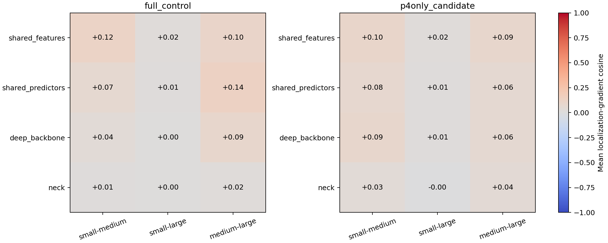
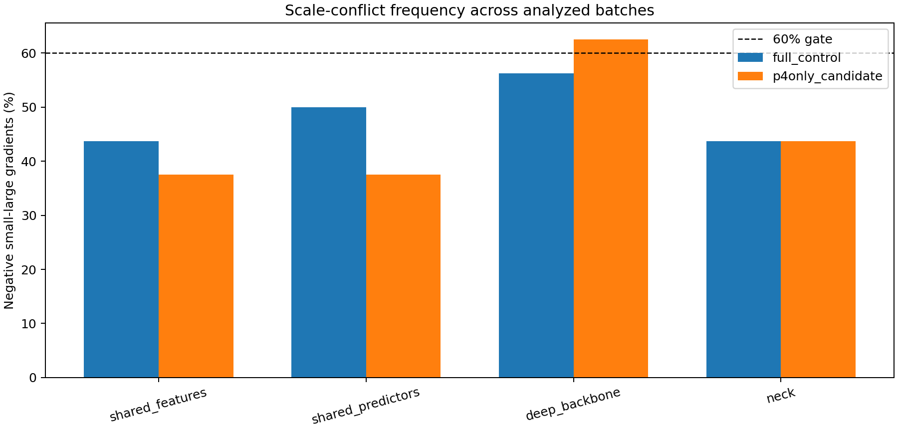

# 尺度梯度冲突诊断报告

> 生成时间：2026-09-05T08:01:57+08:00  
> 固定使用相同的16个训练集batch；表中主结果为box+DFL定位损失梯度。

## Small–Large主结果

| 模型 | 参数组 | 平均余弦 | 中位数 | 负梯度比例 | batch数 |
|---|---|---:|---:|---:|---:|
| full_control | shared_features | +0.022 | +0.020 | 43.8% | 16 |
| full_control | shared_predictors | +0.009 | -0.006 | 50.0% | 16 |
| full_control | deep_backbone | +0.004 | -0.014 | 56.2% | 16 |
| full_control | neck | +0.002 | +0.002 | 43.8% | 16 |
| p4only_candidate | shared_features | +0.017 | +0.024 | 37.5% | 16 |
| p4only_candidate | shared_predictors | +0.011 | +0.006 | 37.5% | 16 |
| p4only_candidate | deep_backbone | +0.015 | -0.007 | 62.5% | 16 |
| p4only_candidate | neck | -0.001 | +0.002 | 43.8% | 16 |

## 预注册判断

- 候选共享特征层：平均余弦 +0.017，负梯度比例 37.5%。
- 候选共享预测器：平均余弦 +0.011，负梯度比例 37.5%。
- 判定条件：任一共享参数组平均余弦 < -0.05、负梯度比例 ≥ 60%、n ≥ 16。

**结论：共享头未达到预注册冲突标准，不实施P4头解耦，停止当前P5修复路线。**

## 解释边界

该诊断使用关闭增强的固定训练样本，并通过只保留单一尺度标注构造尺度条件损失。定位损失是主判据；总损失包含被移除目标在分类项中形成背景的影响，仅作为敏感性分析。梯度冲突可以支持“共享优化存在竞争”，但不能单独证明它是AP变化的唯一原因，仍需通过检测头解耦消融验证因果性。

## 可追溯产物

- `metrics/gradient_cosines.csv`：逐batch余弦、梯度范数、目标数和损失。
- `metrics/gradient_summary.csv`：均值、中位数、标准差和负值比例。
- `metrics/sample_manifest.json`：固定图像与尺度目标计数。
- `metrics/decision.json`：机器可读判定。
