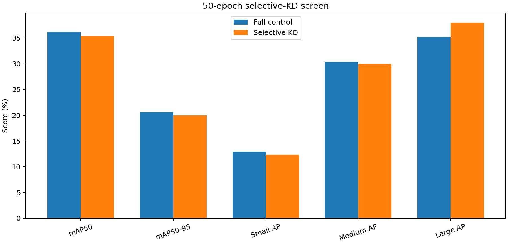
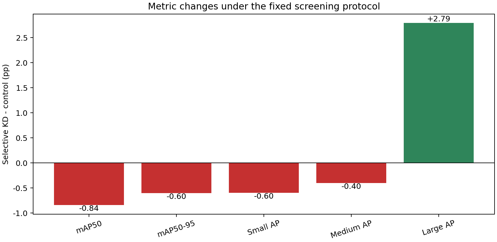

# 尺度选择性知识蒸馏：50轮筛选报告

> 生成时间：2026-09-03T20:21:22+08:00  
> 学生为完整 Drone-YOLO；教师为150轮 YOLOv11s 基线。教师和适配器仅在训练期存在，验证使用保存后的学生模型。

## 1. 统一对比

| 指标 | Full 对照 | Selective KD | Δ（百分点） |
|---|---:|---:|---:|
| mAP50 | 36.21% | 35.37% | -0.84 |
| mAP50-95 | 20.63% | 20.03% | -0.60 |
| Small AP | 12.93% | 12.33% | -0.60 |
| Medium AP | 30.38% | 29.97% | -0.40 |
| Large AP | 35.20% | 37.99% | +2.79 |

| 推理结构 | Full 对照 | Selective KD |
|---|---:|---:|
| 参数量（M） | 2.772 | 2.772 |
| GFLOPs | 19.19 | 19.19 |

## 2. 预注册判定

| 条件 | 实测 | 是否通过 |
|---|---:|---:|
| Large AP Δ ≥ +1.00 pp | +2.79 pp | 是 |
| Small AP Δ ≥ -0.30 pp | -0.60 pp | 否 |
| mAP50-95 Δ ≥ -0.10 pp | -0.60 pp | 否 |
| 参数量、GFLOPs不变 | 一致 | 是 |

**结论：未通过筛选；停止该精确配置，不进入长训。**

## 3. 解释边界

该结果仅检验“基线教师、P3/P4对齐、32²面积掩码、权重0.5”的组合。若未通过，不能外推为所有知识蒸馏方法均无效；更可能的原因包括教师总体精度不足、特征约束与当前检测损失竞争，或中大目标区域掩码过于稀疏/粗糙。

## 4. 可追溯产物

- 预注册方案：`EXPERIMENT_PLAN.md`
- 训练、验证和报告日志：`logs/`
- 结构化指标与比较表：`metrics/`
- 学生检查点：`../../runs/selective_kd_p34_seed0_50e/weights/best.pt`
