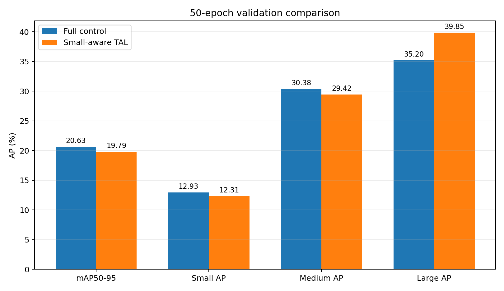
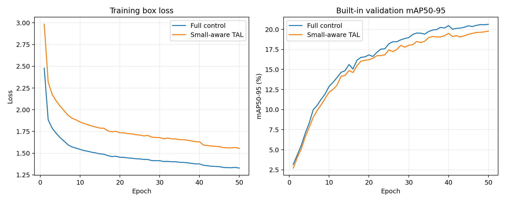

# 小目标感知 TAL：50 轮筛选报告

## 实验结论

**未通过预注册筛选标准。** 本次 50 轮筛选未同时满足预设门槛，应停止该固定配置，不根据当前验证结果继续调参；下一步转向小目标区域采样或切片训练。

## 指标对比

所有 AP、Precision 和 Recall 均以百分数表示，差值单位为百分点（pp）。对照组复用冻结的 `loss_inner_wiou_50e`，实验组为 `small_tal_50e`。

| 指标 | Full 对照 | Small-aware TAL | 差值 |
|---|---:|---:|---:|
| mAP50-95 | 20.6263 | 19.7888 | -0.8375 |
| AP50 | 36.2103 | 35.5029 | -0.7074 |
| Precision | 49.1404 | 46.4825 | -2.6580 |
| Recall | 37.8005 | 38.5324 | +0.7318 |
| Small AP | 12.9291 | 12.3085 | -0.6206 |
| Medium AP | 30.3754 | 29.4166 | -0.9588 |
| Large AP | 35.1959 | 39.8488 | +4.6529 |

## 判据核验

- 未通过：Small AP ≥ +0.50 pp
- 未通过：mAP50-95 ≥ -0.20 pp
- 未通过：Medium AP ≥ -0.50 pp
- 通过：Large AP ≥ -0.50 pp

训练全程无 NaN 或异常中止；该方法仅改变训练期标签分配，模型结构与推理流程保持不变。

## 方法说明

仅对输入坐标系下面积小于 `32² px` 的真实框，将 TAL 的定位质量替换为 `0.5 × CIoU + 0.5 × NWD similarity`；中、大目标仍使用原始 CIoU。回归损失继续采用 Inner-WIoU + DFL，训练设置与对照一致。完整预注册见 [EXPERIMENT_PLAN.md](EXPERIMENT_PLAN.md)。

## 可复核材料

- 实验组检查点：`runs/small_tal_50e/weights/best.pt`
- 实验组统一指标：`reports/small_aware_tal/metrics/small_tal_val.json`
- 实验组尺寸指标：`reports/small_aware_tal/metrics/small_tal_size_val.json`
- 训练日志：`reports/small_aware_tal/logs/small_tal_train.log`
- 评估日志：`reports/small_aware_tal/logs/small_tal_val.log`
