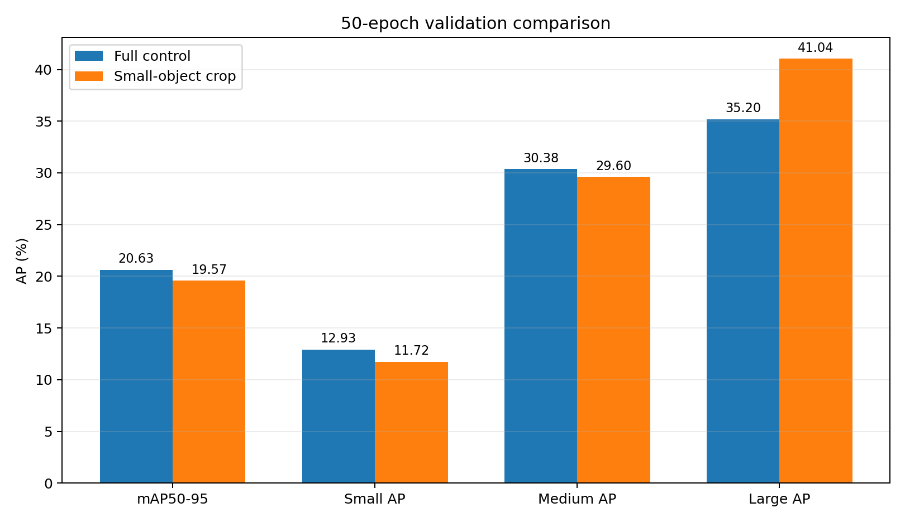
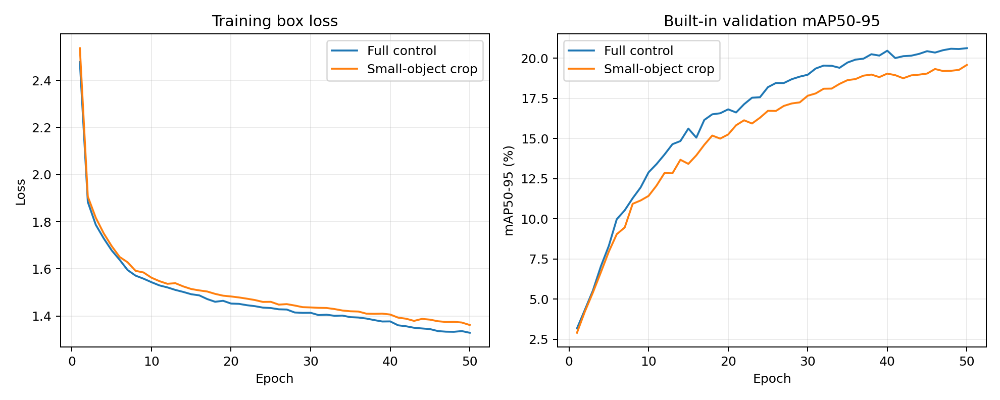
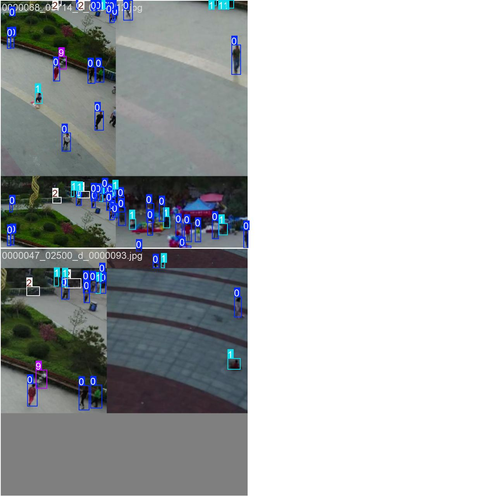

# 小目标中心裁剪训练：50 轮筛选报告

## 实验结论

**未通过预注册筛选标准。** 本配置未同时满足筛选门槛，应停止该固定配置，下一步转向固定训练步数的重叠切片训练。

## 指标对比

所有指标均为百分数，差值单位为百分点（pp）。两组采用相同 Full 模型、初始化、训练步数与验证协议，唯一差异是实验组训练读取时有 50% 概率执行小目标中心裁剪。

| 指标 | Full 对照 | 小目标中心裁剪 | 差值 |
|---|---:|---:|---:|
| mAP50-95 | 20.6263 | 19.5699 | -1.0563 |
| AP50 | 36.2103 | 34.2973 | -1.9131 |
| Precision | 49.1404 | 45.7999 | -3.3405 |
| Recall | 37.8005 | 36.4658 | -1.3347 |
| Small AP | 12.9291 | 11.7194 | -1.2097 |
| Medium AP | 30.3754 | 29.5960 | -0.7795 |
| Large AP | 35.1959 | 41.0408 | +5.8449 |

## 判据核验

- 未通过：Small AP ≥ +0.50 pp
- 未通过：mAP50-95 ≥ -0.20 pp
- 未通过：Medium AP ≥ -0.50 pp
- 通过：Large AP ≥ -0.50 pp

## 方法与可视化

裁剪宽高均为原图的 50%，保证选中的输入空间小目标完整保留，再等比例放大回原尺寸。该操作只用于训练，不改变推理图。

## 可复核材料

- 预注册：`reports/small_object_crop/EXPERIMENT_PLAN.md`
- 实验组检查点：`runs/small_crop_50e/weights/best.pt`
- 总体指标：`reports/small_object_crop/metrics/small_crop_val.json`
- 尺寸指标：`reports/small_object_crop/metrics/small_crop_size_val.json`
- 训练日志：`reports/small_object_crop/logs/small_crop_train.log`
