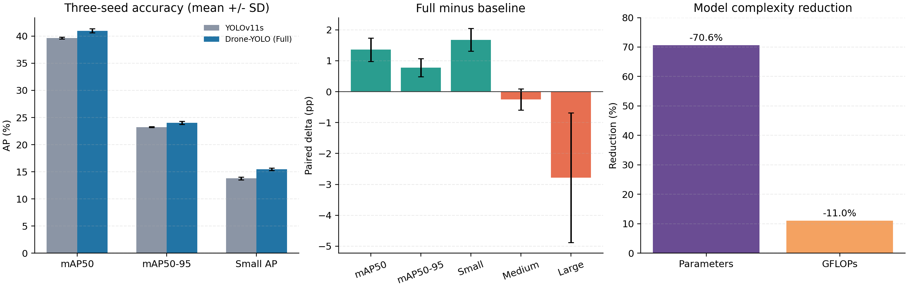
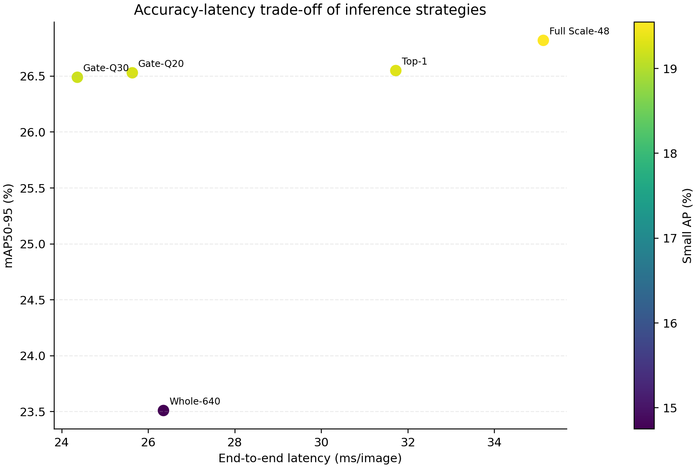
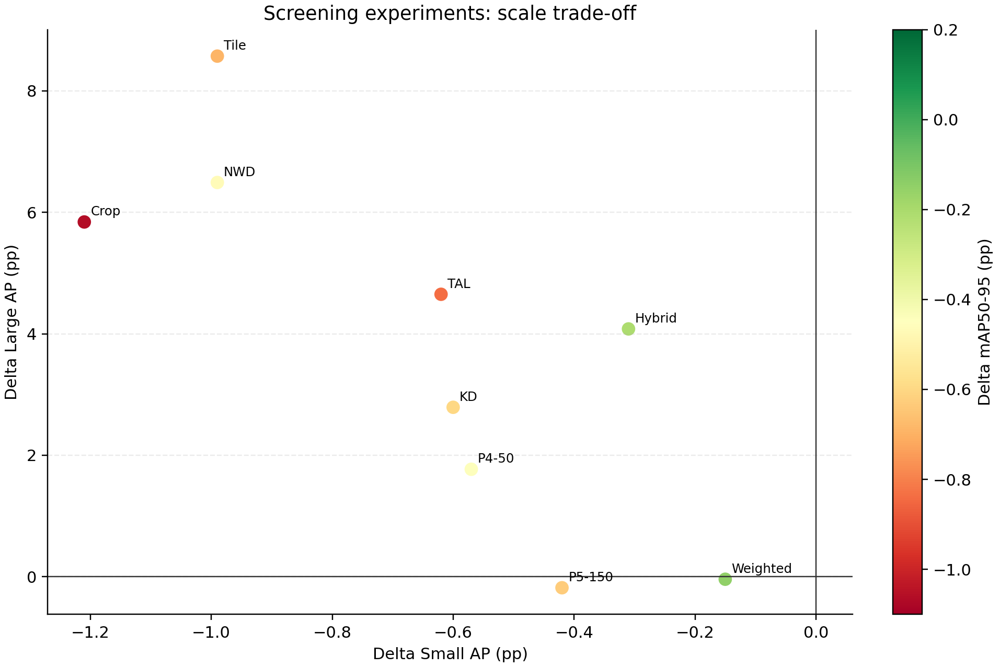

# 第4章 实验设计与结果分析（初稿）

> 本章根据截至 2026 年 9 月 5 日已经完成且可追溯的实验整理。正文可直接作为毕业论文实验章节的基础版本，章节编号可按论文目录调整。本文将原论文方法的复现结论与本项目后续探索严格区分，精度差值单位均为百分点（pp）。

## 4.1 实验目的

本章围绕无人机航拍场景中的小目标检测与模型轻量化开展实验，主要验证以下四个问题：第一，复现的 Drone-YOLO 完整模型能否在相同训练条件下稳定提高 VisDrone2019 数据集上的总体检测精度和小目标检测精度；第二，该模型能否在参数量、计算量和实际推理速度方面形成轻量化优势；第三，MF-FPN、LSCD 和 Inner-WIoU 三个组成部分分别发挥何种作用；第四，在不重新训练模型的条件下，尺度增强推理能否进一步改善小目标检测，并在精度与延迟之间取得可用平衡。

除主要验证实验外，本章还汇总了自适应特征融合、NWD、小目标感知标签分配、切片训练、知识蒸馏以及 P5 语义反馈等探索性实验。未达到预注册条件的实验同样予以报告，用于解释已验证方法的适用边界，并避免仅根据正向结果选择性汇报。

## 4.2 实验设置

### 4.2.1 数据集与评价指标

实验采用 VisDrone2019 数据集。统一验证集包含 548 张图像，使用同一份数据划分和标注转换结果。按原始图像坐标系下的 COCO 面积标准统计，验证集含小目标 26,586 个、中目标 11,105 个、大目标 1,068 个。由此可见，小目标在实例数量上占主体，但单个目标包含的像素信息有限，同时存在密集分布、遮挡和类别相似等问题。

模型精度采用 Precision、Recall、mAP50 和 mAP50-95 评价，并补充 Small AP、Medium AP 和 Large AP 以分析不同尺度目标的表现。复杂度采用参数量和 GFLOPs 衡量，部署效率采用 batch=1 条件下的端到端平均延迟、p95 延迟、FPS 和峰值显存衡量。除特别说明外，表中 AP 类指标均以百分数表示。

### 4.2.2 训练与验证协议

核心对比使用随机种子 0、1、2，基线和完整模型在每个种子下均从 `yolo11s.pt` 独立初始化并训练 150 轮，不从其他模型或种子继续训练。统一验证采用 640×640 输入、FP32、置信度阈值 0.001、NMS IoU 阈值 0.7、`max_det=300`。实验环境为 Python 3.12.10、PyTorch 2.8.0+cu129、Ultralytics 8.4.110 和 NVIDIA GeForce RTX 4080 SUPER。

三随机种子结果使用均值与样本标准差表示，并优先报告相同种子内“完整模型减基线”的配对差值。模块消融主要使用 seed=0 的 150 轮结果，其目的在于定位各阶段的作用，不将单种子差异表述为普遍规律。探索性实验通常先执行 50 轮筛选，只有通过预先设定条件的候选才进入长训练，以控制反复试验造成的验证集过拟合风险。

完整配置、日志与校验信息见[三随机种子核心复现报告](../core_multiseed/README.md)和[统一消融评估报告](../unified_evaluation/README.md)。

## 4.3 核心模型对比

### 4.3.1 三随机种子结果

表 4-1 给出了 YOLOv11s 基线与完整 Drone-YOLO 的三随机种子结果。

**表 4-1 基线与完整模型的三随机种子对比**

| 指标 | YOLOv11s（均值±标准差） | Drone-YOLO（均值±标准差） | 配对变化（均值±标准差） |
|---|---:|---:|---:|
| mAP50 | 39.64±0.15 | 40.99±0.35 | +1.36±0.38 |
| mAP50-95 | 23.24±0.08 | 24.03±0.27 | +0.78±0.29 |
| Small AP | 13.78±0.24 | 15.46±0.22 | +1.68±0.37 |
| Medium AP | 35.09±0.17 | 34.85±0.39 | -0.25±0.34 |
| Large AP | 47.06±1.75 | 44.28±1.62 | -2.78±2.10 |
| 参数量（M） | 9.432 | 2.772 | -70.6% |
| GFLOPs | 21.56 | 19.19 | -11.0% |

完整模型在三个种子上均获得正向的 mAP50、mAP50-95 和 Small AP 增量。其中，mAP50-95 平均提高 0.78 pp，Small AP 平均提高 1.68 pp，且两个指标在 3/3 个随机种子上均为正，说明增益不是由某一次有利初始化单独造成。与此同时，模型参数量从 9.432M 降至 2.772M，减少 70.6%；计算量从 21.56 GFLOPs 降至 19.19 GFLOPs，减少 11.0%。因此，在当前数据集和训练协议下，可以得出“完整模型在大幅压缩参数量的同时，稳定改善总体精度与小目标检测精度”的结论。

结果也呈现出明确的尺度边界。Medium AP 平均下降 0.25 pp，Large AP 平均下降 2.78 pp，且三个种子的 Large AP 差值均为负。由于验证集中大目标仅 1,068 个，Large AP 的随机波动高于其他尺度，但其一致负向变化仍不能忽略。现有证据不支持“完整模型对所有尺度目标均有利”的表述，更准确的结论是模型将有限的表征能力偏向了航拍图像中占多数的小目标。

原论文报告完整模型 mAP50 为 44.3%，本项目三种子均值为 40.99%，相差 3.31 pp；seed=0 统一复测结果为 41.40%，相差 2.90 pp。因此，本实验完成了方法结构和主要趋势的复现，但没有数值复现论文报告的最高精度。可能差异来源包括软件版本、数据转换细节、训练超参数和未公开实现细节，但在缺少逐项对照证据时，不对差距作单一归因。

### 4.3.2 各随机种子的配对稳定性

三个随机种子下，完整模型相对基线的 mAP50-95 增量分别为 +1.11、+0.67 和 +0.57 pp，Small AP 增量分别为 +2.09、+1.38 和 +1.56 pp。虽然增益幅度随种子变化，但方向一致。相比只报告一次训练结果，配对设计能够消除部分由初始化差异带来的干扰，为模型对小目标的稳定收益提供更强证据。

## 4.4 模块消融实验

### 4.4.1 MF-FPN、LSCD 与 Inner-WIoU

为分析各模块作用，对 seed=0 的四个累计阶段进行统一验证，结果如表 4-2 所示。

**表 4-2 模块累计消融结果（seed=0，150 轮）**

| 模型阶段 | P | R | mAP50 | mAP50-95 | Small AP | 参数量（M） | GFLOPs |
|---|---:|---:|---:|---:|---:|---:|---:|
| YOLOv11s | 53.22 | 39.77 | 39.64 | 23.23 | 13.52 | 9.432 | 21.56 |
| +MF-FPN | 54.88 | 40.98 | 41.08 | 24.27 | 15.63 | 3.169 | 24.52 |
| +LSCD | 53.20 | 41.44 | 40.24 | 23.66 | 15.27 | 2.772 | 19.19 |
| +Inner-WIoU | 52.98 | 42.30 | 41.40 | 24.34 | 15.62 | 2.772 | 19.19 |

MF-FPN 相比基线使 mAP50 提高 1.44 pp、mAP50-95 提高 1.04 pp、Small AP 提高 2.11 pp，是完整模型小目标收益的主要来源。其通过引入高分辨率检测特征并融合高层语义与低层几何信息，使小目标在下采样过程中保留更多定位线索。值得注意的是，该阶段虽然参数量明显下降，但 GFLOPs 上升至 24.52，这是高分辨率特征计算带来的代价，说明参数量和计算量不能相互替代。

在 MF-FPN 基础上加入 LSCD 后，参数量由 3.169M 降至 2.772M，GFLOPs 由 24.52 降至 19.19，但 mAP50 下降 0.84 pp、Small AP 下降 0.36 pp。因此，当前实验支持 LSCD 的轻量化作用，但不支持其具有独立精度增益。进一步加入 Inner-WIoU 后，模型结构复杂度不变，mAP50 回升 1.16 pp、mAP50-95 回升 0.68 pp、Recall 提高 0.86 pp，说明该回归策略在当前累计结构上改善了边界框优化。该结论来自单随机种子模块消融，强度低于三种子核心对比，论文中应明确限定。

### 4.4.2 检测尺度消融

为验证高分辨率检测层和低分辨率检测层的作用，在相同 50 轮预算下比较 P2–P4、P2–P5 和 P3–P5 三种 MF-FPN 检测尺度组合。

**表 4-3 检测尺度组合消融**

| 检测尺度 | mAP50 | mAP50-95 | Small AP | Medium AP | Large AP | 参数量（M） | GFLOPs |
|---|---:|---:|---:|---:|---:|---:|---:|
| P2–P4 | 36.60 | 21.14 | 12.72 | 31.69 | 39.21 | 3.169 | 24.52 |
| P2–P5 | 36.71 | 21.28 | 12.90 | 32.07 | 36.32 | 4.286 | 25.42 |
| P3–P5 | 35.54 | 20.44 | 11.50 | 31.26 | 41.66 | 4.280 | 21.25 |

P2–P5 相比 P3–P5 的 mAP50、mAP50-95 和 Small AP 分别提高 1.16、0.83 和 1.40 pp，表明保留 P2 高分辨率检测层对小目标检测具有直接作用。P2–P5 相比 P2–P4 仅提高 0.13 pp 的 mAP50-95 和 0.18 pp 的 Small AP，却增加约 1.117M 参数和 0.90 GFLOPs，同时 Large AP 下降 2.90 pp。综合精度与复杂度，P2–P4 更适合作为面向小目标与轻量部署的主结构。完整数据见[尺度检测层消融报告](../scale_ablation/README.md)。

## 4.5 分尺度与分类别分析

完整模型在 seed=0 上使 Small AP 从 13.52% 提高至 15.62%，Small AP50 从 28.50% 提高至 31.82%，Small AR 从 26.71% 提高至 29.88%。这说明改进不仅增加了高置信度命中，也提升了小目标召回能力。与之相对，Large AP 从 48.17% 降至 46.04%，再次表明轻量化和高分辨率特征强化伴随尺度间能力重新分配。

分类别结果显示，完整模型相对基线的 AP50 增益主要来自 pedestrian（+5.85 pp）、people（+4.63 pp）、motor（+3.59 pp）和 car（+3.12 pp），而 awning-tricycle 下降 1.99 pp。pedestrian 与 people 在航拍图像中通常尺寸较小且密集，因此其明显改善与 Small AP 结果相互印证。bicycle、tricycle 等类别增益接近零，说明仅增强高分辨率特征仍不足以解决外观相似、遮挡和类别边界模糊问题。

## 4.6 轻量化与部署效率

部署实验在 RTX 4080 SUPER 上进行，输入固定为 640×640、batch=1，每次测试预热 50 次并测量 200 次，三个训练种子的模型分别测量后汇总。端到端时间包含图像预处理、模型前向和 NMS/结果后处理，不含磁盘 I/O、模型加载和首次初始化。

**表 4-4 三随机种子端到端部署结果**

| 精度 | 模型 | 平均延迟（ms） | p95 延迟（ms） | FPS | 峰值分配显存（MiB） |
|---|---|---:|---:|---:|---:|
| FP32 | YOLOv11s | 7.61±0.15 | 9.53±0.63 | 131.47±2.49 | 121±21 |
| FP32 | Drone-YOLO | 7.21±0.03 | 9.48±0.34 | 138.73±0.66 | 110±15 |
| FP16 | YOLOv11s | 7.81±0.46 | 10.24±0.48 | 128.25±7.28 | 78±4 |
| FP16 | Drone-YOLO | 7.25±0.42 | 10.35±1.38 | 138.27±7.82 | 71±7 |

在当前软硬件条件下，完整模型相对基线的 FP32 平均延迟降低 5.3%，FP16 平均延迟降低 7.2%，同时峰值显存有所下降。其速度增幅显著小于参数量降幅，原因是端到端延迟还受高分辨率特征计算、算子并行效率、预处理和 NMS 等因素影响。该结果能够支持框架级、固定设备上的部署优势，但不能直接外推至嵌入式平台、ONNX 或 TensorRT。详细结果见[三种子端到端部署基准](../deployment_benchmark/README.md)。

## 4.7 尺度增强与密度门控推理

核心模型训练完成后，进一步测试了整图推理、Scale-48 双尺度联合推理和密度门控策略。此组实验使用同一套预测融合和 COCO 评估管线，适合组内横向比较；由于其计时与前述 `model.val` 和部署基准的实现不同，绝对 AP 与延迟不能跨表直接合并。

**表 4-5 推理策略的精度—延迟权衡**

| 方法 | mAP50-95 | Small AP | Small AR | Medium AP | Large AP | 延迟（ms/图） | FPS |
|---|---:|---:|---:|---:|---:|---:|---:|
| Whole-640 | 23.51 | 14.75 | 24.46 | 34.10 | 45.29 | 26.35 | 37.95 |
| Full Scale-48 | 26.82 | 19.55 | 33.35 | 34.81 | 44.09 | 35.13 | 28.47 |
| Top-1 | 26.55 | 19.31 | 32.57 | 34.55 | 44.09 | 31.72 | 31.53 |
| Gate-Q20 | 26.53 | 19.26 | 32.45 | 34.55 | 44.09 | 25.63 | 39.02 |
| Gate-Q30 | 26.49 | 19.19 | 32.32 | 34.52 | 44.09 | 24.36 | 41.05 |

Full Scale-48 相比 Whole-640 的 mAP50-95 提高 3.31 pp、Small AP 提高 4.80 pp，但延迟增加 33.3%，说明多尺度联合推理可以显著补偿小目标像素不足，其代价是额外推理。该策略不改变模型参数，却不能据此称为模型结构轻量化。

Gate-Q30 通过训练图像的无标签预测分布确定阈值，仅对密度较高的图像触发附加区域推理。在当前实现中，其相对 Whole-640 的 mAP50-95 提高 2.98 pp、Small AP 提高 4.44 pp，延迟由 26.35 ms 降至 24.36 ms。因测速波动和门控实现差异，该“延迟更低”现象仍需在独立运行和更多设备上复验。不过，它说明自适应计算比所有图像固定切片更有潜力作为本项目的后续扩展。

预注册标准以 Full Scale-48 为精度上界，要求候选相对该上界的 AP 下降不超过 0.20 pp。Gate-Q30 下降 0.34 pp，因此没有通过全部预注册条件；不能在报告中改写成“筛选成功”。合理表述应为：Gate-Q30 未达到预先设定的上界保持条件，但相对 Whole-640 形成了有价值的实用权衡。完整门控方案与判定见[密度门控 SAHI 报告](../density_gated_sahi/README.md)。

## 4.8 未通过筛选的探索性实验

表 4-6 汇总未达到继续条件的训练改进。不同候选的对照来自各自预注册实验，表中只报告“候选减相应对照”的差值，不将不同训练批次的绝对结果混合排名。

**表 4-6 负结果与尺度权衡汇总**

| 候选方法 | 预算 | ΔmAP50-95 | ΔSmall AP | ΔMedium AP | ΔLarge AP | 判定 |
|---|---|---:|---:|---:|---:|---|
| 自适应加权融合 | 50轮×3种子 | -0.15 | -0.15 | -0.14 | -0.04 | 淘汰 |
| NWD 损失 | 50轮 | -0.47 | -0.99 | -0.06 | +6.49 | 淘汰 |
| Inner-WIoU+NWD | 50轮 | -0.21 | -0.31 | -0.07 | +4.08 | 淘汰 |
| 小目标感知 TAL | 50轮 | -0.84 | -0.62 | -0.96 | +4.65 | 淘汰 |
| 小目标裁剪训练 | 50轮 | -1.06 | -1.21 | -0.78 | +5.84 | 淘汰 |
| 重叠切片训练 | 50轮 | -0.69 | -0.99 | -0.13 | +8.57 | 淘汰 |
| 尺度选择性知识蒸馏 | 50轮 | -0.60 | -0.60 | -0.40 | +2.79 | 淘汰 |
| P5-lite 语义反馈 | 150轮 | -0.63 | -0.42 | -1.07 | -0.18 | 淘汰 |
| P5-lite 仅增强 P4 | 50轮 | -0.44 | -0.57 | -0.25 | +1.77 | 淘汰 |

这些负结果揭示了三个共同问题。首先，多个方法提高了 Large AP，却降低了 Small AP 和总体 AP，说明额外语义、重采样或匹配规则改变了尺度间优化重心，但没有解决论文所关心的小目标问题。其次，自适应加权融合在三随机种子下仍为负，表明简单学习融合权重不一定优于等权特征融合；增加可学习参数并不自动带来有效信息选择。最后，P5-lite 即使训练 150 轮仍低于完整模型，排除了“50 轮训练不足”这一主要解释，继续延长训练的价值较低。

NWD、TAL、裁剪、切片训练和知识蒸馏的失败不能证明这些方法在其他配置或数据集上无效，只能说明当前接入位置、超参数和训练预算下没有达到本项目预设目标。各实验的详细配置与日志可由[实验报告索引](../README.md)进入查看。

## 4.9 尺度梯度冲突诊断

为判断 P5-lite 失败是否由小目标与大目标梯度强烈冲突造成，项目记录了共享特征和共享预测器上的分尺度定位梯度余弦相似度。P4-only 候选在共享特征上的小目标—大目标平均余弦相似度为 +0.017，负值比例为 37.5%；共享预测器对应数值为 +0.011 和 37.5%。预注册触发条件为平均余弦小于 -0.05 且负值比例不低于 60%，实际结果未达到条件，因此没有继续引入头部解耦。

该诊断说明当前样本中没有观察到持续、强烈的尺度梯度对立，但不能证明模型完全不存在尺度竞争。总目标梯度在共享特征和预测器上分别约为 +0.533 和 +0.491，整体较为一致；P5-lite 的负增益更可能涉及特征质量、门控表达或优化资源重新分配，而现有证据不足以锁定单一原因。详细结果见[尺度梯度冲突诊断](../scale_gradient_conflict/README.md)。

## 4.10 定性结果

同一验证批次的可视化表明，完整模型在远距离行人、密集车辆等区域能够补充部分基线漏检，这与 pedestrian、people 和 Small AP 的定量改善一致。同时，在遮挡严重、类别外观相似或大目标样本较少的场景中仍存在漏检和误分类。定性图片用于展示典型现象，不代替完整数据集上的定量结论。

## 4.11 本章小结

本章在统一协议下完成了 Drone-YOLO 的核心复现、模块消融、尺度分析和部署测试。三随机种子配对结果表明，完整模型相对 YOLOv11s 的 mAP50-95 平均提高 0.78 pp，Small AP 平均提高 1.68 pp，同时参数量减少 70.6%、GFLOPs 减少 11.0%，FP32 端到端平均延迟降低 5.3%。消融实验显示，MF-FPN 是小目标精度提升的主要来源，LSCD 的主要价值体现在压缩检测头，Inner-WIoU 在当前累计结构上恢复并提高定位精度。模型收益具有尺度边界，Medium AP 和 Large AP 未同步改善，且当前复现精度低于原论文报告值。

进一步实验表明，Full Scale-48 能显著提高小目标精度，但增加推理开销；密度门控在未达到预注册精度保持条件的情况下，相对整图推理呈现出较好的实用权衡。其余九项结构或训练策略均未达到继续条件，负结果集中体现为小目标收益下降或尺度间性能转移。综合现有证据，后续不宜继续无目标地叠加模块，而应优先完成跨数据集验证、嵌入式或 TensorRT 部署测试，并对密度门控进行独立重复测量，从而增强结论的外部有效性和工程可信度。

## 4.12 主张—证据边界（写作自检）

| 论文主张 | 可用证据 | 写作强度 |
|---|---|---|
| 完整模型稳定提高小目标与总体精度 | 三种子配对结果，两个指标 3/3 为正 | 可作为核心结论 |
| 完整模型实现结构轻量化 | 参数量 -70.6%，GFLOPs -11.0% | 可作为核心结论 |
| 完整模型提高本机框架级推理效率 | 三种子 FP32/FP16 端到端测试 | 可限定设备与协议后陈述 |
| MF-FPN 是主要小目标收益来源 | seed=0 累计消融和尺度层消融 | 可陈述，但注明单种子消融 |
| LSCD 独立提高检测精度 | 当前阶段增量为负 | 不可主张；只能强调轻量化作用 |
| 模型对所有尺度均有益 | Large AP 三种子均下降 | 不可主张 |
| 达到原论文 44.3% mAP50 | 当前结果低于原文 | 不可主张 |
| Gate-Q30 已通过预注册筛选 | 相对 Full Scale-48 的 AP 降幅超限 | 不可主张；仅作探索性权衡 |
| P5-lite 失败由尺度梯度冲突造成 | 梯度触发条件未满足 | 不可归因 |

## 4.13 后续实验优先级

1. **跨数据集外部验证。** 在 UAVDT 或 TinyPerson 等数据集上固定主模型和超参数，只进行必要的数据格式适配，验证小目标增益是否能够迁移。
2. **密度门控独立复测。** 固定 Q30 阈值，不再在 VisDrone 验证集调参，重复 3 次端到端计时并报告均值、标准差和 p95；若条件允许，再在第二张 GPU 或边缘设备复测。
3. **部署后端验证。** 导出 ONNX/TensorRT，核对精度误差后测量 batch=1 的真实延迟、吞吐率和显存，补足“轻量化可部署”的工程证据。
4. **最终论文材料收束。** 以本章三种子主表、模块消融表、部署表和负结果表为核心，不再把未通过筛选的候选包装为贡献；方法章节明确区分原论文结构复现和本项目提出的推理扩展。

---

### 可追溯数据

- 本章核心数据表：[`metrics/`](metrics/)
- 本章重新绘制的汇总图：[`figures/`](figures/)
- 核心三种子原始汇总：[三随机种子核心复现](../core_multiseed/README.md)
- seed=0 模块与定性分析：[统一消融评估](../unified_evaluation/README.md)
- 部署实验：[三种子端到端部署基准](../deployment_benchmark/README.md)
- 推理扩展：[Scale-48 联合推理](../scale48_joint_inference/README.md)、[密度门控](../density_gated_sahi/README.md)
- 其余筛选实验：[实验报告索引](../README.md)
