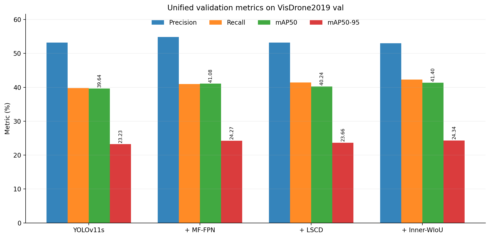
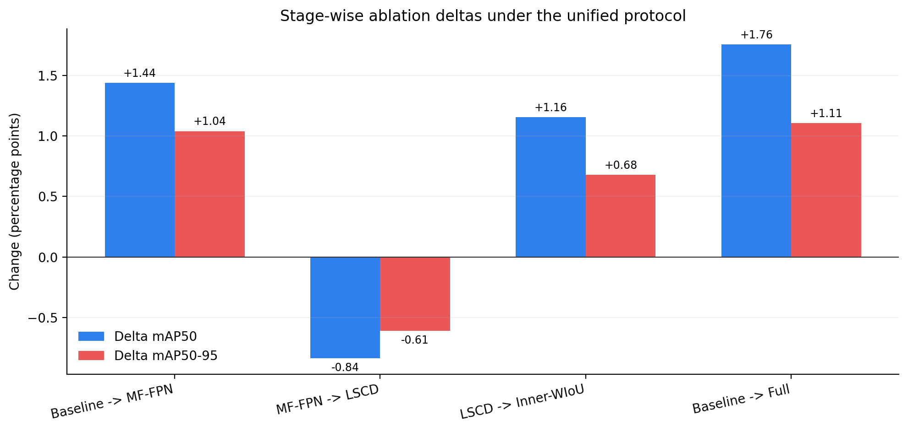
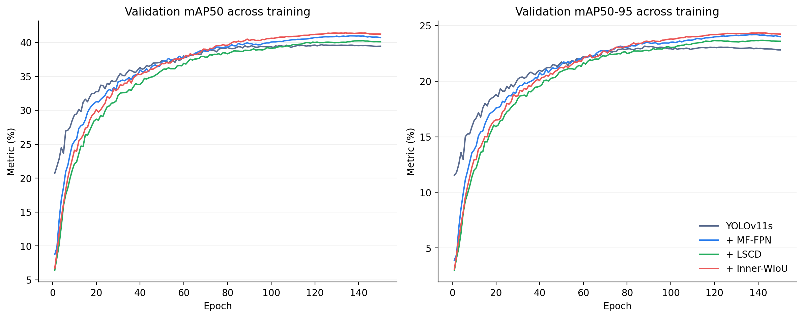
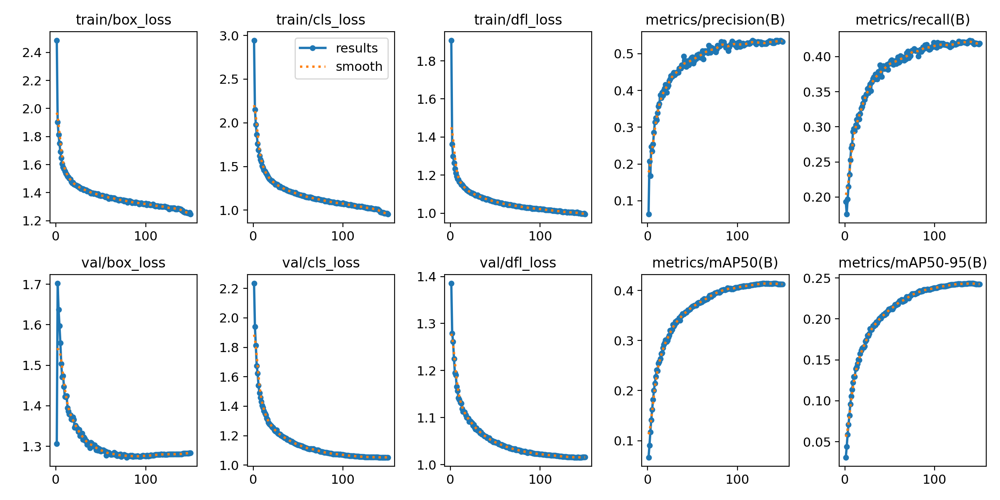
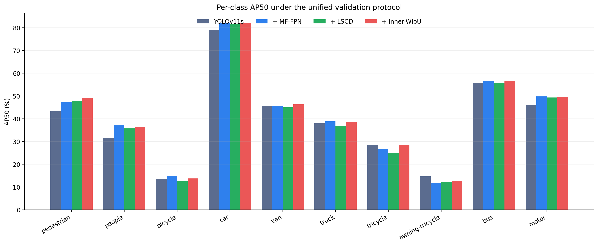
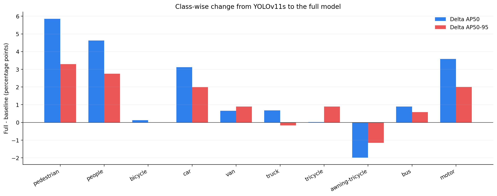
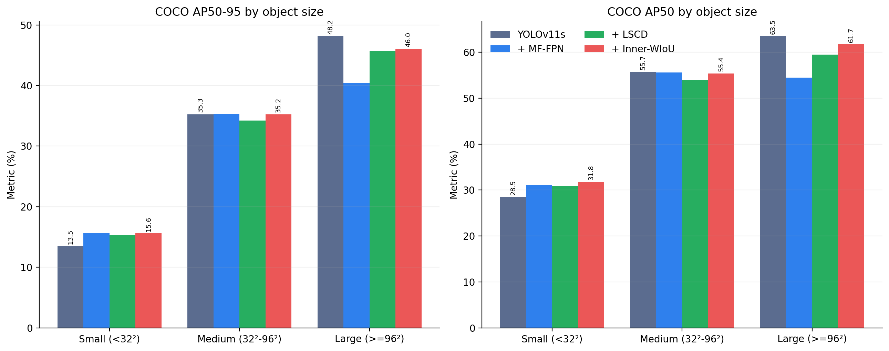
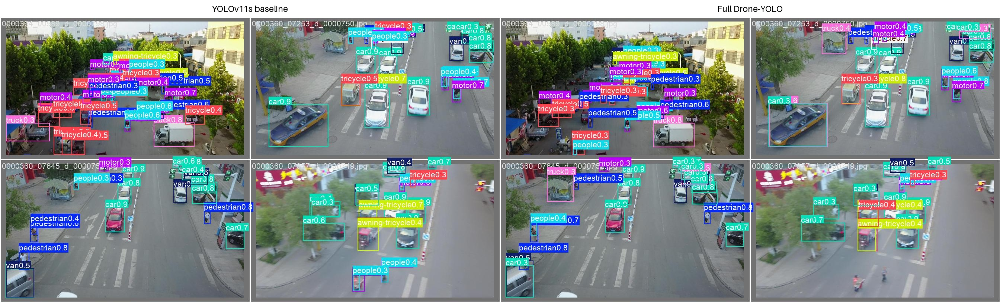
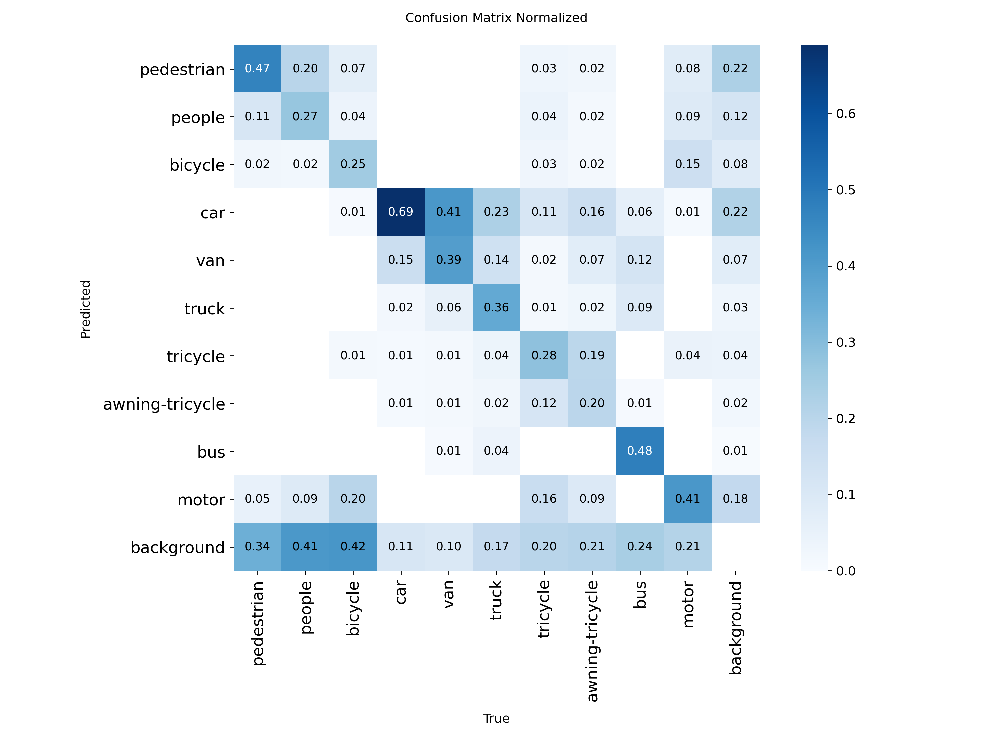
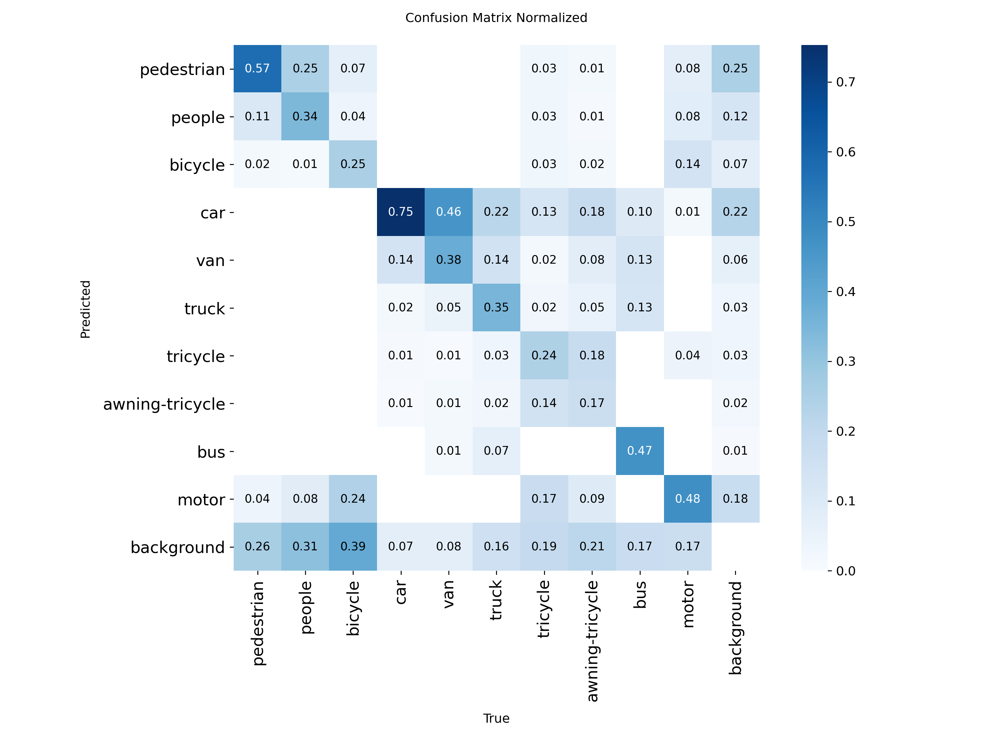

# Drone-YOLO 复现实验统一评估报告

> 生成时间：2026-08-23T10:13:12+08:00  
> 报告性质：四组 `best.pt` 在同一验证协议下的统一复测；训练过程指标仅用于定位最佳轮次和观察收敛。

## 1. 结论摘要

完整模型在统一复测中取得 **mAP50=41.40%、mAP50-95=24.34%、Recall=42.30%**。相较基线，mAP50 提升 **1.76 个百分点**，mAP50-95 提升 **1.11 个百分点**，Recall 提升 **2.53 个百分点**。

按原图目标面积进行 COCO 分桶后，完整模型的 Small AP 相对基线提升 **2.09 个百分点**，Small AP50 提升 **3.32 个百分点**；但 Large AP 变化为 **-2.12 个百分点**。因此，当前结果支持模型对小目标更有利，但这种收益并非对所有尺度都一致。

分阶段结果表明：MF-FPN 带来 +1.44 个百分点的 mAP50 变化；在 MF-FPN 基础上加入 LSCD 后变化为 -0.84 个百分点；进一步加入 Inner-WIoU 后变化为 +1.16 个百分点。因此，当前复现证据支持 MF-FPN 与 Inner-WIoU 的有效性，但 LSCD 的独立增益尚未复现，需要继续做结构参数对照。

论文报告的完整模型 mAP50 为 44.30%，当前统一复测与其相差 **2.90 个百分点**。该差距应被视为复现边界，而不是忽略或用训练过程中的峰值替代。

## 2. 实验设置与公平性约束

四个检查点均使用相同数据划分、输入尺寸、置信度阈值、NMS IoU 阈值和最大检测数，并分别在独立 Python 进程中加载，避免自定义 LSCD 检测头与 Inner-WIoU 运行时注册相互影响。

| 项目 | 统一设置 |
|---|---|
| 数据集 | VisDrone2019 `val`（548 张图像，548 个标签文件） |
| 输入尺寸 | 640 × 640 |
| Batch size | 4 |
| Precision mode | FP32 |
| conf / IoU / max_det | 0.001 / 0.7 / 300 |
| GPU | NVIDIA GeForce RTX 4080 SUPER |
| 软件 | Python 3.12.10；PyTorch 2.8.0+cu129；Ultralytics 8.4.110 |
| 随机性 | 推理阶段无数据增强；四组采用相同确定性验证协议 |

## 3. 统一复测结果

表中精度来自本次统一复测；“最佳轮次”来自各训练日志中 mAP50-95 最大的轮次。推理耗时包含当前软件环境下的单图前向时间，不等同于端到端部署 FPS。

| 阶段 | 最佳轮次 | P | R | mAP50 | mAP50-95 | 参数量(M) | GFLOPs | 推理(ms/图) |
|---|---:|---:|---:|---:|---:|---:|---:|---:|
| YOLOv11s | 88 | 53.22% | 39.77% | 39.64% | 23.23% | 9.432 | 21.56 | 1.79 |
| + MF-FPN | 139 | 54.88% | 40.98% | 41.08% | 24.27% | 3.169 | 24.52 | 1.57 |
| + LSCD | 142 | 53.20% | 41.44% | 40.24% | 23.66% | 2.772 | 19.19 | 1.37 |
| + Inner-WIoU | 140 | 52.98% | 42.30% | 41.40% | 24.34% | 2.772 | 19.19 | 1.38 |

## 4. 训练过程与收敛情况

四组训练均完成 150 轮。下图直接读取各运行目录中的 `results.csv`，展示验证 mAP 的完整变化轨迹；统一复测结果以 `best.pt` 为准，因此不应使用最后一轮替代最佳检查点。

## 5. 分类别结果

分类别 AP 可以揭示总体均值背后的收益来源。下表给出四阶段 AP50，以及完整模型相对基线的变化。

| 类别 | 基线 AP50 | MF-FPN AP50 | LSCD AP50 | 完整模型 AP50 | 完整模型 AP50-95 | AP50变化 |
|---|---:|---:|---:|---:|---:|---:|
| pedestrian | 43.30% | 47.25% | 47.84% | 49.15% | 22.46% | +5.85 pp |
| people | 31.75% | 37.12% | 35.74% | 36.38% | 14.16% | +4.63 pp |
| bicycle | 13.63% | 14.85% | 12.60% | 13.75% | 5.92% | +0.12 pp |
| car | 79.08% | 82.10% | 81.79% | 82.20% | 56.61% | +3.12 pp |
| van | 45.71% | 45.54% | 44.99% | 46.37% | 32.68% | +0.66 pp |
| truck | 38.03% | 38.87% | 36.91% | 38.70% | 24.93% | +0.68 pp |
| tricycle | 28.46% | 26.80% | 25.11% | 28.48% | 16.42% | +0.01 pp |
| awning-tricycle | 14.73% | 11.88% | 12.22% | 12.74% | 8.00% | -1.99 pp |
| bus | 55.73% | 56.61% | 55.86% | 56.63% | 40.36% | +0.90 pp |
| motor | 45.97% | 49.77% | 49.35% | 49.56% | 21.84% | +3.59 pp |

## 6. 按目标尺寸分桶评估

本节在原始图像坐标系中采用 COCO 面积定义：Small＜32²像素，Medium为32²–96²像素，Large≥96²像素。验证集共包含 26586 个小目标、11105 个中目标和 1068 个大目标。所有模型使用同一份转换标注、conf=0.001、NMS IoU=0.7 和 max_det=300。

| 阶段 | 全部 AP | Small AP | Small AP50 | Small AR | Medium AP | Large AP |
|---|---:|---:|---:|---:|---:|---:|
| YOLOv11s | 23.46% | 13.52% | 28.50% | 26.71% | 35.26% | 48.17% |
| + MF-FPN | 24.46% | 15.63% | 31.15% | 29.71% | 35.28% | 40.47% |
| + LSCD | 23.87% | 15.27% | 30.82% | 29.17% | 34.21% | 45.72% |
| + Inner-WIoU | 24.55% | 15.62% | 31.82% | 29.88% | 35.24% | 46.04% |

完整模型的 Small AP 从 13.52% 提升至 15.62%，Small AP50 从 28.50% 提升至 31.82%。MF-FPN 是小目标收益的主要来源；LSCD 阶段略有回落，Inner-WIoU 随后恢复并进一步提升。Large AP 相对基线下降，说明高分辨率检测层和轻量检测头可能改变了尺度间的能力分配，后续优化不能只观察总体 mAP。

这里的 COCO AP 使用 pycocotools 在原图面积上独立计算，与 Ultralytics 类别均值的实现细节略有不同；四模型之间的尺寸比较使用完全相同的评估器，因此横向增量有效。

## 7. 定性结果与混淆矩阵

以下可视化来自同一验证批次，适合用于观察漏检、密集遮挡和相邻类别混淆。图片只能辅助解释，定量结论仍以统一复测表为准。

## 8. 诊断与下一步实验

1. **LSCD 参数对照。** 当前累计阶段在加入 LSCD 后未获得正向 mAP50 增益。下一步应固定其余条件，对隐藏通道宽度、GroupNorm 分组数和初始化方式做 30–50 轮筛选，再对最佳配置训练 150 轮。
2. **尺度权衡验证。** 当前 Small AP 获得提升而 Large AP 下降。应通过保留一个低分辨率检测层、调整尺度损失权重或增加尺度均衡蒸馏，验证能否保住小目标收益并恢复大目标性能。
3. **重复实验。** 至少对基线和完整模型增加两个随机种子，报告均值与标准差，避免把单次波动写成确定性增益。
4. **部署测量。** 在 PyTorch、ONNX 或 TensorRT 下分别测量预热后的吞吐率、端到端延迟和显存峰值，完善轻量化证据。

## 9. 可追溯产物

- 统一指标：`metrics/summary.csv`
- 分类别指标：`metrics/per_class_metrics.csv`
- 分尺寸指标：`metrics/size_metrics.csv`、`metrics/per_class_size_metrics.csv`
- 每组完整结构化记录：`metrics/*_val.json`
- 每组控制台日志：`logs/*_val.log`
- 分尺寸评估记录与日志：`metrics/*_size_val.json`、`logs/*_size_val.log`
- 跨领域小目标方法整理：[`../small_object_detection_methods.md`](../small_object_detection_methods.md)
- Ultralytics 原生评估图片：对应 JSON 中的 `save_dir`，本报告复制了基线与完整模型的代表性图片。
- 检查点完整性：每份 JSON 均记录绝对路径、文件大小和 SHA-256。

## 10. 主张—证据映射

| 主张 | 证据 | 状态 |
|---|---|---|
| 完整模型优于当前基线 | mAP50 +1.76 pp，mAP50-95 +1.11 pp | 已支持 |
| Inner-WIoU 对当前累计模型有效 | 相比 LSCD 阶段，mAP50 +1.16 pp | 已支持（单随机种子） |
| LSCD 独立提升精度 | 相比 MF-FPN 阶段，mAP50 -0.84 pp | 未支持，需新实验 |
| 完整模型改善小目标 | Small AP +2.09 pp，Small AP50 +3.32 pp | 已支持（单随机种子） |
| 完整模型对各尺度均有利 | Large AP -2.12 pp | 未支持 |
| 模型具有部署轻量化优势 | 已有参数量/GFLOPs，但无统一预热FPS与端到端延迟 | 部分支持 |

## 11. 审稿人式自检

| 维度 | 判断 | 需要补充的证据 |
|---|---|---|
| 贡献 | 需要修订 | 明确本研究相对原论文是复现、验证还是进一步改进 |
| 写作清晰度 | 通过 | 保持各阶段名称和累计关系一致 |
| 实验强度 | 需要新实验 | 增加随机种子并报告均值±标准差 |
| 评估完整性 | 需要修订 | 已补充尺寸分桶；仍需测试集、困难场景和定性失败案例 |
| 方法设计可靠性 | 需要新实验 | 解释 LSCD 负增益并验证关键结构参数 |

---

本报告仅陈述当前日志能够支持的结论；未进行的实验均明确标记为待验证。
