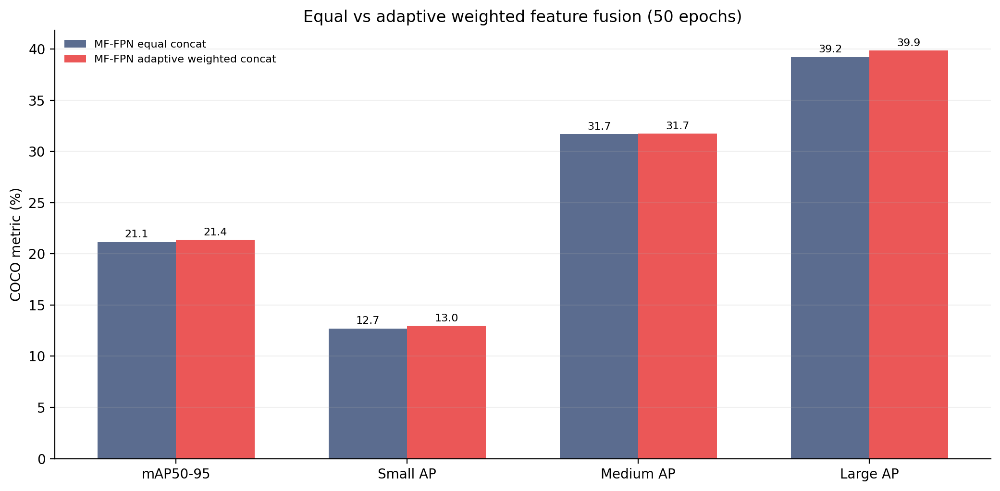
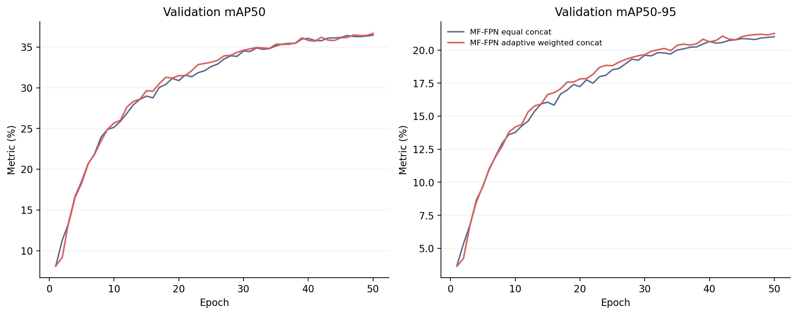
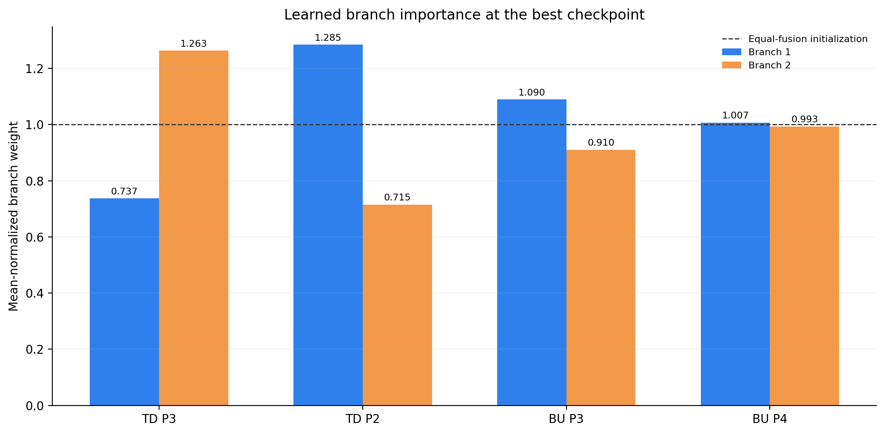

# 自适应加权 MF-FPN：50轮消融报告

> 生成时间：2026-08-26T01:30:58+08:00  
> 对照性质：仅将4个普通Concat替换为均值归一化的AdaptiveWeightedConcat；其余训练与验证协议一致。

## 1. 结果

| 结构 | mAP50 | mAP50-95 | Small AP | Small AP50 | Medium AP | Large AP | 参数量(M) | GFLOPs |
|---|---:|---:|---:|---:|---:|---:|---:|---:|
| MF-FPN equal concat | 36.60% | 21.14% | 12.72% | 26.40% | 31.69% | 39.21% | 3.169422 | 24.52 |
| MF-FPN adaptive weighted concat | 36.74% | 21.37% | 12.96% | 26.65% | 31.74% | 39.86% | 3.169430 | 24.52 |

## 2. 相对公平对照的变化

加权融合相对等权融合的 mAP50 变化为 **+0.14 pp**，mAP50-95为 **+0.23 pp**；Small AP为 **+0.24 pp**、Small AP50为 **+0.25 pp**、Medium AP为 **+0.05 pp**、Large AP为 **+0.64 pp**。参数量变化 **+0.0003%**，GFLOPs变化 **+0.0000%**。

## 3. 学得的融合权重

| 融合节点 | 分支1及权重 | 分支2及权重 |
|---|---:|---:|
| TD P3 | upsampled P4: 0.7368 | lateral P3: 1.2632 |
| TD P2 | upsampled P3: 1.2848 | lateral P2: 0.7152 |
| BU P3 | downsampled P2: 1.0896 | top-down P3: 0.9104 |
| BU P4 | downsampled P3: 1.0067 | deep P4: 0.9933 |

每个节点的两项权重均值为1；高于1表示该分支相对等权初始化被增强，低于1表示被抑制。权重用于解释模型行为，不单独证明因果收益。

## 4. 预注册判定

| 条件 | 实际变化 | 是否通过 |
|---|---:|---:|
| Small AP至少+0.30 pp | +0.24 pp | 否 |
| mAP50-95下降不超过0.10 pp | +0.23 pp | 是 |
| Large AP下降不超过1.00 pp | +0.64 pp | 是 |
| 参数量和GFLOPs变化均不超过0.1% | +0.0003% / +0.0000% | 是 |

**结论：未同时达到预注册晋级条件，不建议直接投入150轮；应依据失败项决定调整或停止该方向。**

## 5. 主张—证据映射

| 主张 | 证据 | 状态 |
|---|---|---|
| 加权融合改善小目标检测 | Small AP变化 +0.24 pp | 当前不支持 |
| 加权融合不增加实质部署开销 | 参数 +0.0003%，GFLOPs +0.0000% | 支持 |
| 加权融合是最终有效贡献 | 尚无150轮、多随机种子与延迟结果 | 不能声称 |

## 6. 可追溯产物

- 预注册方案：`EXPERIMENT_PLAN.md`
- 日志：`logs/`
- 指标与权重：`metrics/`
- 最佳检查点：`../../runs/mffpn_weighted_50e/weights/best.pt`

本报告只把50轮结果用于结构筛选，并明确保留单随机种子的证据限制。
