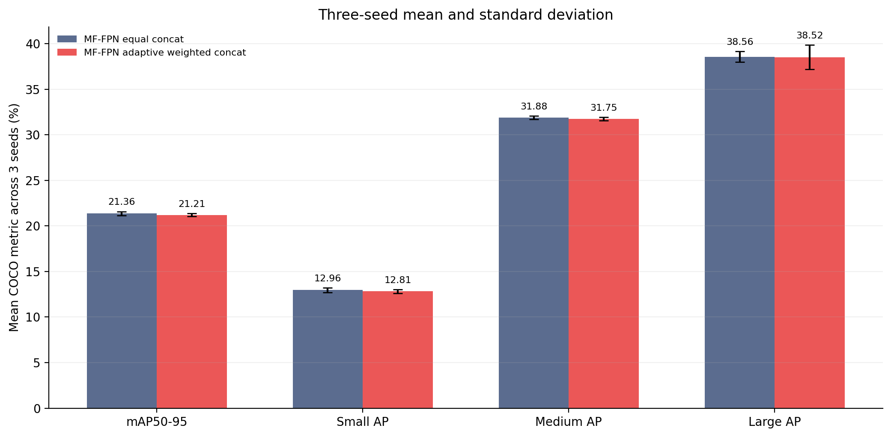
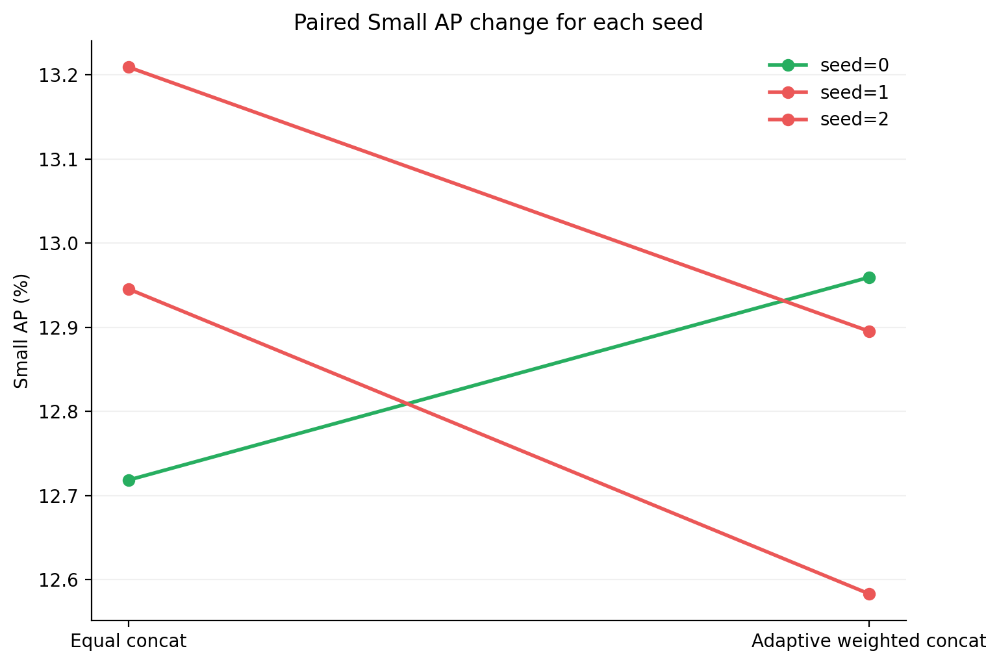
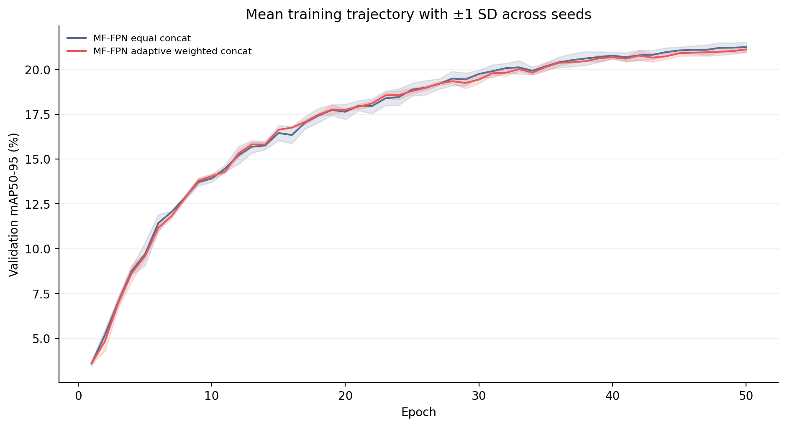
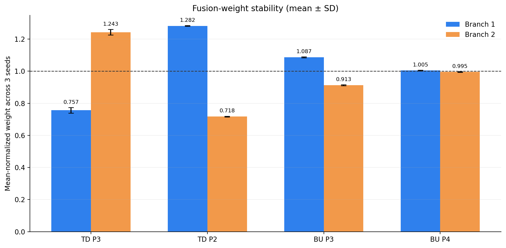

# 自适应加权 MF-FPN：三随机种子配对复验报告

> 生成时间：2026-08-26T20:49:36+08:00  
> 报告口径：三次独立50轮运行的均值±样本标准差；配对差值均按同一种子“加权−普通”计算。

## 1. 三种子汇总

| 结构 | mAP50 | mAP50-95 | Small AP | Small AP50 | Medium AP | Large AP |
|---|---:|---:|---:|---:|---:|---:|
| MF-FPN equal concat | 36.72 ± 0.11 | 21.36 ± 0.23 | 12.96 ± 0.25 | 26.85 ± 0.44 | 31.88 ± 0.17 | 38.56 ± 0.58 |
| MF-FPN adaptive weighted concat | 36.51 ± 0.25 | 21.21 ± 0.17 | 12.81 ± 0.20 | 26.45 ± 0.40 | 31.75 ± 0.17 | 38.52 ± 1.33 |

## 2. 配对差值

| Seed | ΔmAP50-95 | ΔSmall AP | ΔSmall AP50 | ΔMedium AP | ΔLarge AP |
|---:|---:|---:|---:|---:|---:|
| 0 | +0.23 | +0.24 | +0.25 | +0.05 | +0.64 |
| 1 | -0.31 | -0.36 | -0.87 | -0.07 | -1.19 |
| 2 | -0.36 | -0.31 | -0.57 | -0.39 | +0.43 |
| 平均 | -0.15 | -0.15 | -0.40 | -0.14 | -0.04 |

三个种子中有 **1/3** 个种子的Small AP为正增益。均值和标准差用于稳定性描述；由于只有3个种子，本实验不作强统计显著性声明。

## 3. 融合权重稳定性

每组权重被归一化为均值1。跨种子方向一致才可作为稳定行为解释；权重本身不替代检测指标的因果证据。明细见`metrics/fusion_weights_all_seeds.csv`。

## 4. 预注册晋级判定

| 条件 | 实际结果 | 是否通过 |
|---|---:|---:|
| 平均Small AP增量≥+0.30 pp | -0.15 pp | 否 |
| Small AP正增益种子数≥2/3 | 1/3 | 否 |
| 平均mAP50-95增量≥-0.10 pp | -0.15 pp | 否 |
| 平均Large AP增量≥-1.00 pp | -0.04 pp | 是 |
| 参数量和GFLOPs变化≤0.1% | +0.0003% / +0.0000% | 是 |

**结论：未通过全部预注册条件。停止加权融合晋级，下一步转入NWD/IoU混合回归损失筛选。**

## 5. 主张—证据映射

| 主张 | 当前证据 | 状态 |
|---|---|---|
| 加权融合稳定改善小目标 | 平均ΔSmall AP -0.15 pp，正增益1/3 | 不支持 |
| 加权融合不损害总体和大目标 | 平均ΔmAP50-95 -0.15 pp，ΔLarge AP -0.04 pp | 不支持 |
| 加权融合是最终完整模型贡献 | 尚未进行完整模型150轮实验 | 不能声称 |

## 6. 可追溯产物

- 预注册方案：`EXPERIMENT_PLAN.md`
- 全部日志：`logs/`
- 单次、聚合、配对及融合权重数据：`metrics/`
- 四个新增检查点：`../../runs/mffpn*_seed[12]_50e/weights/best.pt`
